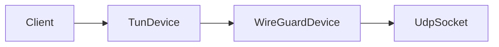
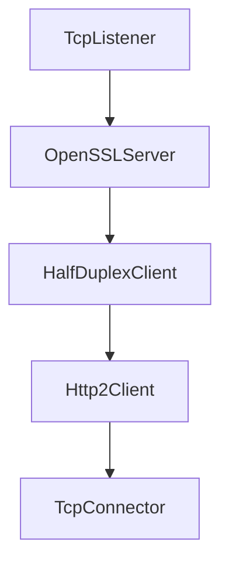

# معرفی WaterWall

WaterWall یک چارچوب قدرتمند و انعطاف‌پذیر برای ایجاد تونل‌های شبکه و اتصالات سفارشی کاربر-سرور است. این پلتفرم بر پایه **معماری مدولار** و گره‌های (**nodes**) کاملاً قابل پیکربندی با کارایی بالا بنا شده است، که امکان پیاده‌سازی طیف گسترده‌ای از پروتکل‌های شبکه را بدون نیاز به کدنویسی پیچیده فراهم می‌کند.

## چرا WaterWall؟

### 🚀 **سرعت و کارایی**

- **معماری چند Thread**: پردازش همزمان با thread-per-core
- **Zero-Copy Operations**: کاهش کپی داده‌ها برای حداکثر throughput
- **Buffer Pool Management**: مدیریت بهینه حافظه
- **Hardware Acceleration**: استفاده از شتاب سخت‌افزاری برای رمزگذاری

### 🧩 **مدولار و انعطاف‌پذیر**

- **Node-based Architecture**: ترکیب آسان گره‌ها برای ایجاد پروتکل‌های پیچیده
- **JSON Configuration**: پیکربندی ساده بدون نیاز به کدنویسی
- **Hot Reload**: تغییر پیکربندی بدون قطع سرویس
- **Cross-platform**: پشتیبانی از Linux، Windows، macOS

### 🔒 **امنیت پیشرفته**

- **Multi-layer Encryption**: رمزگذاری چندلایه
- **Protocol Obfuscation**: پنهان‌سازی ترافیک
- **Anti-Censorship**: مقاومت در برابر فیلترینگ
- **Certificate Validation**: اعتبارسنجی گواهی‌های SSL/TLS

## ویژگی‌ها و قابلیت‌های کلیدی

### 🌐 **گره‌های شبکه (Network Nodes)**

- **TcpListener/TcpConnector**: مدیریت اتصالات TCP با قابلیت‌های پیشرفته
- **UdpStatelessSocket**: پردازش بسته‌های UDP بدون حفظ وضعیت
- **Load Balancing**: توزیع هوشمند ترافیک بین چندین backend
- **Freebind**: انتخاب خودکار IP از محدوده CIDR

### 🖥️ **گره‌های دستگاه (Device Nodes)**

- **TunDevice**: ایجاد interface های مجازی TUN
- **WireGuardDevice**: پیاده‌سازی کامل پروتکل WireGuard
- **RawSocket**: دسترسی مستقیم به بسته‌های شبکه
- **PacketToConnection**: تبدیل packets به connections

### 🔐 **گره‌های پروتکل (Protocol Nodes)**

- **OpenSSLServer/Client**: رمزگذاری TLS 1.3 با cipher suites مدرن
- **Http2Server/Client**: پشتیبانی کامل از HTTP/2 و gRPC
- **RealityServer/Client**: پروتکل Reality برای دور زدن فیلترینگ
- **TrojanServer/Client**: پروتکل Trojan با مقاومت TLS-in-TLS

### ⚡ **گره‌های پیشرفته (Advanced Nodes)**

- **HalfDuplexClient/Server**: تقسیم کانال‌های upload/download
- **IpManipulator**: دستکاری headers و پروتکل‌های IP
- **IpOverrider**: تغییر آدرس‌های IP source/destination
- **PacketToConnection**: تبدیل packet-based به connection-based

### 🎯 **سناریوهای کاربرد**

#### **VPN و تونل‌سازی**

#### **Load Balancer پیشرفته**

#### **Security Gateway**

## مسیر یادگیری 📚

### 1️⃣ **شروع کنید**

- [نصب و راه‌اندازی](getting-started/installation)
- [مفاهیم پایه](getting-started/basic-concepts)
- [شروع سریع](getting-started/quick-start)

### 2️⃣ **یاد بگیرید**

- [پراکسی ساده](tutorials/basic-proxy)
- [پایان TLS](tutorials/ssl-termination)

### 3️⃣ **پیاده‌سازی کنید**

- [نمونه‌های ساده](examples/simple-examples)
- [الگوهای پیشرفته](examples/advanced-patterns)

### 4️⃣ **مستقر کنید**

- [استقرار Production](guides/deployment)
- [امنیت](guides/security)
- [بهینه‌سازی](guides/performance)

## عملکرد و آمار 📊

### **Benchmarks**

- **Throughput**: +10 Gbps در hardware مناسب
- **Latency**: کمتر از 1ms overhead در local network
- **Memory Usage**: شروع از 250KB (minimal profile)
- **CPU Efficiency**: استفاده بهینه از CPU cores

### **مقیاس‌پذیری**

- **Concurrent Connections**: میلیون‌ها اتصال همزمان
- **Multi-threading**: automatic scaling بر اساس CPU cores
- **Memory Pooling**: مدیریت بهینه منابع
- **Load Distribution**: توزیع هوشمند بار

## جامعه و پشتیبانی 🤝

### **منابع**

- **GitHub**: [radkesvat/WaterWall](https://github.com/radkesvat/WaterWall)
- **Issues**: گزارش باگ و درخواست ویژگی
- **Discussions**: بحث و پرسش در جامعه
- **Documentation**: این مستندات جامع

### **مشارکت**

- **Open Source**: کاملاً رایگان و open-source
- **Community Driven**: توسعه با مشارکت جامعه
- **Cross-platform**: پشتیبانی از تمام platform های اصلی

## سخن پایانی

WaterWall یک پلتفرم **next-generation** برای ساخت انواع تونل‌های شبکه و پروتکل‌های سفارشی است. با **معماری مدولار**، **عملکرد بالا** و **امنیت پیشرفته**، WaterWall ابزاری قدرتمند برای مدیران شبکه، توسعه‌دهندگان و متخصصان امنیت است.

آماده‌اید که سفر خود با WaterWall را شروع کنید؟ 🚀

---

### دانشنامه اصطلاحات

- **Node**: واحدهای پردازشی مستقل که وظیفه‌های خاص شبکه را انجام می‌دهند
- **Chain**: زنجیره‌ای از گره‌ها که داده‌ها از طریق آن‌ها عبور می‌کند
- **Upstream/Downstream**: جهت جریان داده‌ها (به سمت سرور/به سمت کلاینت)
- **TLS 1.3**: جدیدترین نسخه پروتکل Transport Layer Security
- **HTTP/2**: نسخه بهبودیافته HTTP با قابلیت multiplexing
- **gRPC**: چارچوب مدرن RPC بر پایه HTTP/2
- **WireGuard**: پروتکل VPN مدرن و سریع
- **Reality Protocol**: پروتکل anti-censorship برای دور زدن فیلترینگ
- **Trojan**: پروتکل تونل‌سازی مقاوم در برابر تشخیص
- **Load Balancing**: توزیع ترافیک بین چندین سرور
- **TUN Device**: رابط شبکه مجازی در لایه 3
- **Zero-Copy**: تکنیک بهینه‌سازی برای کاهش کپی داده‌ها
- **Buffer Pool**: مجموعه بافرهای حافظه قابل استفاده مجدد
- **Thread-per-Core**: معماری threading برای بهینه‌سازی عملکرد
