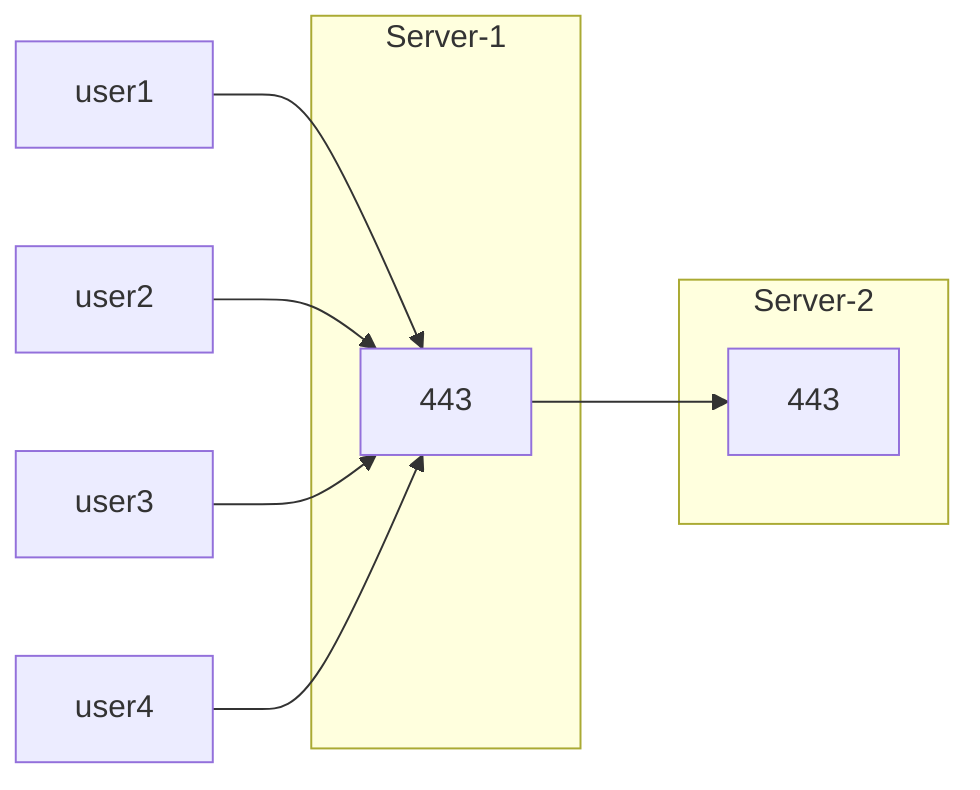
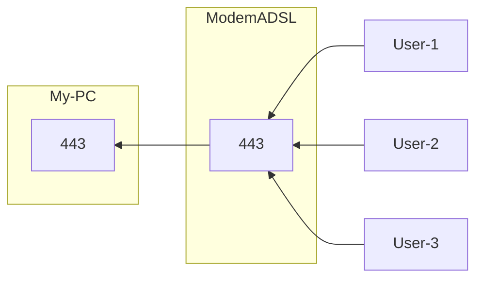

# آموزش بخش دوم

به بخش دوم آموزش خوش آمدید! 🎉

در ابتدا می‌خواهم یکمی اطلاعات عمومی‌تان را بالا ببرم و مفاهیم پایه شبکه مثل آیپی، پورت، TCP، UDP و پورت فورواردینگ را تعریف کنم تا دوستانی که مبتدی هستند هم بتوانند این آموزش را مطالعه کنند. 📚

سپس نوشتن کانفیگ فایل برای واتروال را آغاز می‌کنیم. 🚀

💡 **نکته:** چت جی‌پی‌تی کانفیگ‌های واتروال را به راحتی متوجه می‌شود. اگر جایی کانفیگی دیدید که برایتان مبهم بود، کافی است فایل JSON را به چت جی‌پی‌تی بدهید و از آن بخواهید این کانفیگ فایل را برایتان کامل توضیح دهد.

---

## 1️⃣ آدرس IP (Internet Protocol Address)

**تعریف:**
آدرس IP یک شناسه‌ی عددی است که به هر دستگاه متصل به شبکه (مانند کامپیوتر، گوشی، سرور) اختصاص داده می‌شود. این آدرس برای مسیریابی بسته‌های داده بین مبدا و مقصد در شبکه‌های محلی (LAN) و اینترنت به کار می‌رود. 🌐

* **ساختار IPv4:** چهار بخش عددی از 0 تا 255 که با نقطه از هم جدا شده‌اند. مثال: `192.168.1.10`
* **ساختار IPv6:** هشت بلوک چهارتایی هگزادسیمال، جداشده با ":". مثال: `2001:0db8:85a3:0000:0000:8a2e:0370:7334`

> 💡 **نکته:** IPv4 به‌دلیل محدودیت تعداد آدرس، به تدریج جای خود را به IPv6 می‌دهد و یا اینکه از NAT کمک می‌گیرد که باعث می‌شود یک آیپی به بیشتر از یک نفر یا دستگاه بتواند سرویس دهد.
> 
> عموماً شبکه‌های موبایل از این ویژگی استفاده می‌کنند و همچنین مودم‌هایی که با آن‌ها به اینترنت وصل هستید همه از NAT استفاده می‌کنند.
> 
> به همین دلیل شما و سایر اعضای خانواده که به یک وای‌فای وصل هستید، همه از یک آدرس آیپی پابلیک استفاده می‌کنید هنگام بازدید از سایت‌ها. 🏠
> 
> همچنین شبکه‌های VPN هم همینطور هستند و برای تمام کاربران از یک آیپی استفاده می‌کنند. 🔐

---

## 2️⃣ پورت (Port)

**تعریف:**
پورت در لایه‌ی انتقال (Transport Layer) شبکه، یک عدد 16 بیتی (0 تا 65535) است که به هر سرویس و پروتکل روی دستگاه اجازه می‌دهد ارتباط‌های همزمان و مجزایی برقرار کند. 🔌

پورت مشخصه‌ای برای پروتکل‌های TCP/UDP هست و در سایر پروتکل‌های لایه آیپی معنی ندارد.

* **پورت‌های شناخته‌شده (Well-Known Ports):** 0 تا 1023 (مثلاً HTTP روی پورت 80، HTTPS روی پورت 443)
* **پورت‌های ثبت‌شده (Registered Ports):** 1024 تا 49151
* **پورت‌های خصوصی/دینامیک (Dynamic/Private):** 49152 تا 65535

> 🔍 **نکته:** هر بار که یک مرورگر، کلاینت ایمیل یا هر برنامه‌ی دیگری بخواهد با سروری ارتباط برقرار کند، یک پورت مبدا تصادفی انتخاب می‌کند و برای مقصد، پورت مشخص شده در سرویس را هدف می‌گیرد.

---

## 3️⃣ TCP (Transmission Control Protocol)

**تعریف:**
TCP یک پروتکل **اتصال‌گرا** در لایه‌ی انتقال است که برای انتقال مطمئن و تضمین شده‌ی داده‌ها بین مبدا و مقصد استفاده می‌شود. 🔗

### ویژگی‌ها:

1. **سه‌مرحله‌ای (Three-way Handshake):** 🤝
   * برقراری اتصال با تبادل بسته‌های SYN، SYN-ACK و ACK

2. **تضمین تحویل:** ✅
   * بسته‌ها را شماره‌گذاری (Sequence Number) می‌کند و در صورت عدم دریافت تأیید (ACK)، دوباره ارسال می‌کند

3. **کنترل جریان (Flow Control):** 🌊
   * با استفاده از پنجره‌ی دریافت (Window Size) از اشباع شبکه جلوگیری می‌کند

4. **کنترل ازدحام (Congestion Control):** 🚦
   * با الگوریتم‌هایی مانند TCP Reno و TCP Cubic نرخ ارسال را با توجه به وضعیت شبکه تنظیم می‌کند

> 💻 **مثال:** هنگام بارگذاری یک صفحه‌ی وب یا دانلود فایل، TCP تضمین می‌کند که تمام اطلاعات به ترتیب صحیح به دست‌تان برسد.

---

## 4️⃣ UDP (User Datagram Protocol)

**تعریف:**
UDP یک پروتکل **بدون اتصال** (Connectionless) و سبک‌وزن در لایه‌ی انتقال است که تضمینی برای تحویل یا ترتیب بسته‌ها ندارد. ⚡

### ویژگی‌ها:

* **سرعت بالا و سربار کم:** 🚀 به‌دلیل عدم کنترل جریان و تأیید بسته‌ها
* **مناسب برای کاربردهای بلادرنگ:** 📺 مانند پخش ویدئو/صوت آنلاین، VoIP، بازی‌های آنلاین
* **عدم تضمین ترتیب و تحویل:** ❌ بسته‌ها ممکن است گم شوند یا به‌صورت نامرتب برسند

> 🎬 **مثال:** برای پخش زنده‌ی ویدئو، بهتر است کمی افت فریم داشته باشیم ولی تأخیر بسیار کم باشد، تا از پخش روان و بلادرنگ لذت ببریم.

---

## 5️⃣ پورت فورواردینگ (Port Forwarding)

**تعریف:**
فرآیندی است که بسته‌های دریافتی از اینترنت یا یک شبکه‌ی دیگر را روی مسیری مشخص (پورت و/یا IP مقصد) در شبکه‌ی داخلی شما هدایت (Forward) می‌کند. 🔄

این کار می‌تواند روی هر دستگاهی مثل مودم، سرور لینوکسی یا حتی موبایل هم صورت بگیرد. 📱💻

### 🔧 مثال عملی:

زمانی که شما پورت 443 خودتان را به پورت 443 یک آیپی مشخص فوروارد می‌کنید:

این باعث می‌شود هر کسی که یک کانکشن TCP به پورت 443 شما بزند، شما هم یک کانکشن به پورت 443 آیپی‌ای که مشخص کرده‌اید بزنید و سپس مثل یک کابل تلفن، هرچیزی که روی آن کانکشن برایتان آمد را به مقصد بگویید و هرچیزی هم که سرور مقصد به شما گفت به مبدا بگویید. 📞

این دقیقاً یک‌نوع NAT است چون سرور مقصد دیگر آیپی کاربر را نمی‌بیند و فقط سرور مبدا را می‌بیند و با آن ارتباط دارد. 🔒

### 🔄 فورواردینگ معکوس:

پورت فورواردینگ می‌تواند برعکس هم صورت بگیرد و ویژگی محافظتی یک NAT را نادیده بگیرد و از آن عبور کند.

این کاربرد را در مودم‌های ADSL دیده‌اید که هکرها یک پورت را به آیپی لوکال خودشان فوروارد می‌کنند و آن‌وقت مودم خانگی انگار یک سرور شده که می‌شود آیپی‌اش و پورت فوروارد شده را در مرورگر باز کرد و به هاست روی کامپیوتر شخصی دسترسی یافت. 🏠⚠️

### کاربردها:

* **دسترسی به سرورهای خانگی:** 🏠 مثلاً وب‌سرور یا دوربین مدار بسته
* **اجرای بازی‌های آنلاین از پشت NAT:** 🎮 به دوستان اجازه دهید وارد سرور محلی شما شوند
* **VPN و انتقال امن سرویس‌ها:** 🔐 فوروارد کردن پورت‌های امن از فایروال

---

هم اکنون به بخش بعدی آموزش می رویم تا سناریو های مختلف را پیاده کنیم