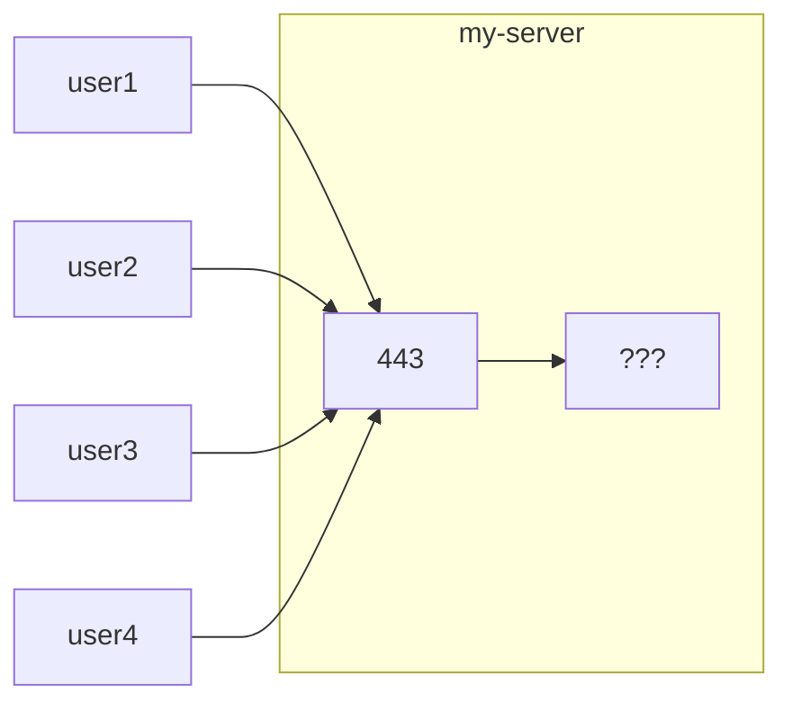
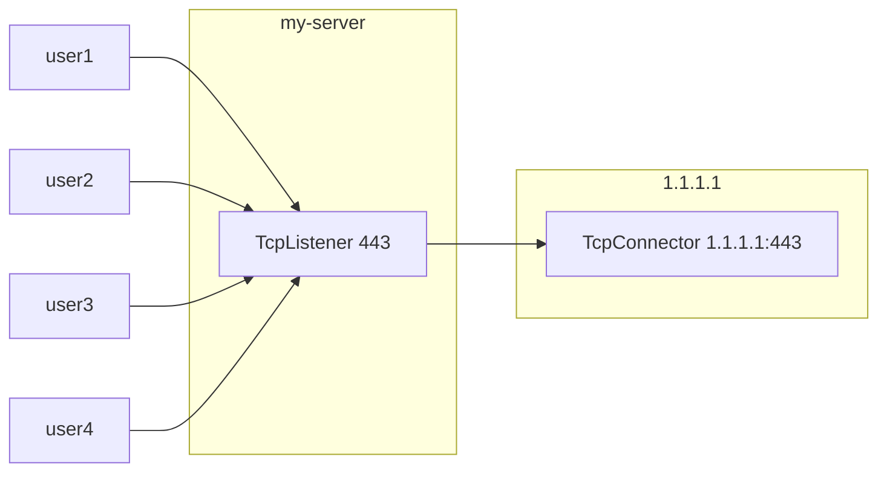
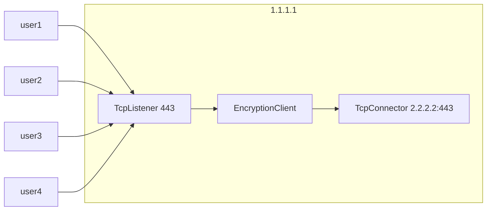
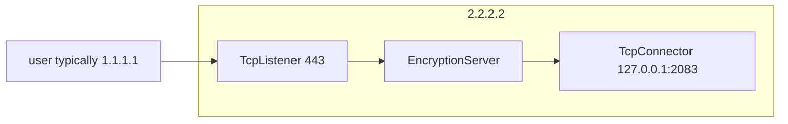

# آموزش بخش سوم

### درک Node و ساخت کانفیگ فایل 📝


اگر یادتان باشد در بخش اول ما فایل **core.json** را آماده کردیم و درون آن گفتیم که می‌خواهیم کانفیگ فایل **config.json** را اجرا کنیم.

هم‌اکنون فایل **config.json** را ایجاد می‌کنیم و به ساختار زیر می‌رسیم:


```
~/waterwall/
├── Waterwall          # فایل اجرایی برنامه
├── core.json          # تنظیمات اصلی
├── config.json        # فایل کانفیگ  
```


## ساختار کلی config file 📋

این فایل در حالت کلی به شکل زیر است:

```json
{
    "name": "my-config-name",    // اسم کانفیگ
    "author": "Ali",             // اختیاری ؛ نام نویسنده کانفیگ
    "config-version": 101 ,      // اختیاری؛ نسخه ی کانفیگ که الان معنی 1.01 میده
    "core-minimum-version": 139, // اختیاری؛ حداقل نسخه مورد نیاز واتروال که الان 1.39 تنظیم شده
    "encrypted":false,           // اختیاری؛ اگه کانفیگ رمز شده باشد
    "nodes": [
        // نود هایی که میخواهید قرار بدید که جلو تر توضیح داده میشه
    ]
}
```

## مفهوم Node ⚙️

به طور کلی در واتروال تمام کارها با Node ها انجام می‌شوند، و در مرحله اول باید بدانیم چه node هایی برای استفاده موجود هست.
شما می‌توانید لیست Node ها را از منوی سمت راست ببینید. همچنین، هر Node یک صفحه مستقل دارد که امکانات و جزئیات مربوط به آن را به‌طور کامل توضیح می‌دهد.

همچنین، از طریق کد پروژه هم می‌توانید node ها را پیدا کنید و کد های هرکدام را بخوانید. برای برنامه نویسان، هر node یک مثال کامل است
که با خواندن آن می‌توانند نحوه کار با API های واتروال و پیاده‌سازی ایده‌های خود را یاد بگیرند.

در سورس کد پروژه، داخل پوشه tunnels لیست تمام node های قابل استفاده و کد هایشان قرار گرفته است.

از
[این لینک](https://github.com/radkesvat/WaterWall/tree/main/tunnels)
هم می‌توانید استفاده کنید تا در گیت‌هاب ببینید. 🔗

### نوع  هر Node 🏷️

هر node یک مشخصه دارد یا بهتر است بگویم (نوع) دارد. شما در فایل JSON، هر node را اینگونه تعریف می‌کنید: 

```json
{
    "name": "my-awesome-node-name", // این اسم را به دلخواه انتخاب می‌کنیم؛ که بعداً می‌گویم با همین اسم می‌توانیم node ها را متصل کنیم
    "type": "TcpListener", // این تعیین می‌کند که نوع ما از چه نوعی است و این باید دقیقاً مطابق باشد با آن چیزی که می‌خواهید استفاده کنید
    
    "settings":{  // هر node می‌تواند تنظیماتی اختیاری یا اجباری داشته باشد که شما در این بخش به آن می‌دهید
     
     "address": "0.0.0.0", // در این مثال، این node از ما این مقدار را خواسته که به آن می‌گوییم به همه آدرس‌ها گوش کن
     "port": 2053,         // این Node همچنین به پورت نیاز دارد که به آن دادیم
     "nodelay": true       // این مقدار را می‌شود گفت همیشه برای این Node ما true تعیین می‌کنیم؛ توضیحات این را در صفحه خودش بخوانید
     
    },
    "next": "my-next-node-name" // اگر این node قابلیت زنجیر شدن داشته باشد، ما به آن اسم Node بعد را می‌دهیم

}
```

در کامنت‌ها سعی کردم کوتاه هرکدام را توضیح دهم ولی الان کامل‌تر توضیح می‌دهم: 📝

- **مقدار name** 🏷️

این یک اسم دلخواه است که به هر node باید داد

و همچنین برای زنجیر کردن node ها به هم باید از این اسم استفاده کنیم. اینکه زنجیر چیست را جلوتر توضیح می‌دهم.

- **مقدار type** 🔧

شما هر node که انتخاب می‌کنید در صفحه مستندات‌اش نوشته که Type چیست که باید همان را اینجا بگذارید تا واتروال بتواند کد های هر node را پیدا کند.

حروف بزرگ و کوچک هم مهم است و اگر اسمی استفاده کنید که غلط باشد، به شما در لاگ این را اطلاع می‌دهد و سپس برنامه خارج می‌شود.

- **مقدار settings** ⚙️

بعضی از node ها نیاز به تنظیمات دارند، مثلاً ما اینجا از node TcpListener استفاده کردیم

که خب همه می‌دانند برای گوش دادن به tcp باید پورت و همچنین آدرس داشته باشیم.

این Node قابلیت‌های بیشتری هم دارد که در صفحه مخصوص به خودش می‌توانید پیدا کنید و با آن آشنا شوید. اینجا برای مثال ما همین تنظیمات را فقط به آن دادیم تا موقع اجرا 
خطا به ما ندهد.

اینکه چه تنظیماتی اجباری و اختیاری هستند در صفحه مربوط به هر node می‌توان یافت.

تنظیمات هر node مجزا است و ربطی به سایر node ها ندارد.

- **مقدار next** 🔗

این را پایین‌تر توضیح می‌دهم که چیست. به طور کلی برای زنجیر کردن node ها استفاده می‌شود. 


## زنجیر چیست؟ 🔗

فرض کنید که ما برنامه را الان اجرا کنیم و فقط یک node داریم از نوع TcpListener.

این باعث می‌شود که برنامه به پورتی که مشخص کردیم گوش دهد و منتظر باشد یک کاربر به آن اتصال بزند و وصل شود.

خب سوال اصلی اینست که بعدش چی می‌شود؟

خب هیچی! 😅 الان چیزی که داریم هیچ کاری انجام نمی‌دهد با آن connection و خب این یک سناریو اشتباه است.

ما مثلاً می‌خواهیم که بعدش اطلاعات کاربر با یک الگوریتم خاصی رمز شود و به یک سرور ارسال شود.

یا مثلاً اطلاعات تکه تکه شوند و قطعه قطعه ارسال شوند.

یا اینکه بخشی از ترافیک به یک سرور برود و بخشی به یک سرور دیگر.

و خیلی کار دیگر که می‌شود با واتروال انجام داد ولی اینجا هنوز هیچ توضیحی به هسته نداده‌ایم و خود هسته

این اشتباه شما را تشخیص می‌دهد و وقتی اجرا هم بکنید به شما می‌گوید که زنجیر ناقص است و برنامه خارج می‌شود. ⚠️




برای پیاده‌سازی سناریو های دلخواه، شما باید node ها را به هم پیوند بزنید. 🔗

# چطور یک زنجیر درست کنیم؟ 🛠️

اولین سوال همیشه اینست که چه چیزی می‌خواهید پیاده کنید؟ عموم کاربران نمی‌خواهند چیز جدیدی پیاده کنند و از روش‌های معروفی که هست استفاده می‌کنند. کانفیگ 
فایل این روش‌ها هم در منوی سمت راست بخش examples قرار دارد. تنها کاری که لازم است بکنند اینست که مقدار IP و پورت سرور هایشان را قرار دهند. 📁

ولی اگر شما می‌خواهید کامل‌تر یاد بگیرید و همچنین سناریو دلخواه خود را طراحی کنید، باید ابتدا به یک تصور اولیه از آن برسید که دقیقاً قرار است
چه کاری با data انجام دهیم. 🤔

سپس باید Node های مورد نظر خود را انتخاب کرده و به هم پیوند بزنید و از اینجا فقط می‌شود با مثال توضیح داد. 📚

### مثال اول: پورت فوروارد 🔄

این یکی از ساده‌ترین سناریو ها است که می‌شود پیاده کرد و برای آموزش خوب است. اگر شما در ساخت VPN و همچنین تونل زدن اندکی تجربه داشته باشید،

شاید همین الان متوجه شده باشیم که ما می‌خواهیم الان روشی را پیاده کنیم که شما با این دستور iptables اجرا می‌کرده‌اید:

```bash
sudo ufw disable
sudo sysctl net.ipv4.ip_forward=1

iptables -t nat -A PREROUTING -p tcp --dport 443 -j DNAT --to-destination 1.1.1.1:443
iptables -t nat -A POSTROUTING -j MASQUERADE
```

اینجا ما می‌خواهیم دقیقاً یک NAT ساده پیاده کنیم. می‌خواهیم پورت ۴۴۳ سرور ایرانمان را فوروارد کنیم به پورت ۴۴۳ سرور خارج از ایرانمان. 🌐

این باعث می‌شود یک تونل ساده ایجاد شود:

```json
    {
       "name": "my-tcp-listener",
       "type": "TcpListener",
       "settings": {
           "address": "0.0.0.0",
           "port": 443,
           "nodelay": true
       },
       "next": "my-tcp-connector"
    },

    {
        "name": "my-tcp-connector",
        "type": "TcpConnector",
        "settings": {
            "nodelay": true,
            "address": "1.1.1.1",
            "port": 443
        }
    }
```

- IP سرور خارج 1.1.1.1 فرض شده است 🌍

با اجرای این کانفیگ، هر connection دقیقاً مثل سیم تلفن وصل می‌شود به آن IP و پورت که دادیم داخل TcpConnector.

اینجا ما یک زنجیر ساختیم که ۲ عدد Node داخل آن است. 🔗

حالا شاید بپرسید که از کجا باید جای هر node در زنجیر را بفهمید؟ این در مستندات هر node توضیح داده می‌شود ولی در کل ما ۳ دسته داریم:

- یک سری از Node ها فقط می‌توانند شروع کننده یک زنجیر باشند مثل همین TcpListener 🚀
- یک سری دیگر فقط در وسط زنجیر قرار می‌گیرند که در مثال بعدی یکی را می‌بینیم ⚙️
- یک سری دیگر فقط در پایان یک زنجیر باید بیایند و بعدش دیگر چیزی به زنجیر اضافه نمی‌شود مثل همین TcpConnector 🎯

در کل، دیاگرام چیزی که الان پیاده کردیم می‌شود این: 




# مثال دوم 🔐

در این مثال ما می‌خواهیم یک تونل بین سرور ایران و سرور خارج پیاده کنیم. می‌خواهیم یک رمزنگاری اطلاعات داشته باشیم بین سرور ایران و خارج.

یعنی داده‌ها وقتی می‌خواهند به سرور خارج ارسال شوند، رمزنگاری شوند.

و در سرور خارج هم بعد از دریافت شدن از رمزنگاری خارج شوند و سپس به یک برنامه دیگر مثل xray ارسال شوند تا آن data را پردازش کند.

و همچنین برعکس آن هم صدق می‌کند، یعنی وقتی سرور خارج به ایران data ارسال می‌کند، رمزنگاری هم برقرار می‌شود. 🔄

اینجا ما IP سرور ایران را 1.1.1.1 فرض می‌کنیم و IP سرور خارج هم 2.2.2.2 فرض می‌کنیم.

### سرور ایران 🇮🇷

در مرحله اول، قبل از دیدن فایل JSON بهتر است با دیاگرام نمایش دهیم که چی می‌خواهیم درست کنیم.

در سرور ایران قرار است واتروال این کانفیگ را اجرا کند:



در اینجا یک node از نوع EncryptionClient اضافه شده است. 🔐

این node وقتی اطلاعات از سمت چپ به راست می‌روند (به دیاگرام دقت کنید) data را رمز می‌کند
و همچنین وقتی data از راست به چپ می‌روند، آن را از حالت رمز خارج می‌کند.

تمامی node ها در واتروال این ویژگی دو حالته بودن را دارند، یعنی در حالتی که data به سمت راست حرکت کند و یا به چپ. ↔️

شما در تنظیمات node EncryptionClient می‌توانید الگوریتم مورد نظرتان و پسورد را قرار دهید.

### سرور خارج 🌐

در سرور خارج باید این دیاگرام اجرا شود:



اینجا ما آمدیم از EncryptionServer استفاده کردیم. 🔓

این node دقیقاً مثل EncryptionClient است با این تفاوت که وقتی data از سمت چپ به راست می‌آید، آن را از رمزنگاری خارج می‌کند و وقتی data 
از راست به چپ می‌رود، آن را رمز می‌کند.

فرض شده که در پورت 2083 سرور خارج ما یک برنامه مثل xray در حال اجرا است. 🛡️

البته می‌توانستیم یک VPN کامل بسازیم با خود واتروال و مثلاً وصل کنیم به node های trojan و بدون نیاز به xray کار کنیم. خب این‌ها بستگی دارد که 
چی دوست دارید پیاده کنید. مثلاً اگر اکانتی که به کاربران دادید از نوع Vless است و تا زمانی که واتروال چنین node نداشته، باید از xray کمک بگیرید و data را
به دست آن برسانید.

خب، حالا فایل JSON سرور ایران را ببینیم که خیلی شبیه به همین دیاگرام سرور ایران است که دیدید:

```json
    {
       "name": "my-tcp-listener",
       "type": "TcpListener",
       "settings": {
           "address": "0.0.0.0",
           "port": 443,
           "nodelay": true
       },
       "next": "my-enc-client"
    },
    {
        "name": "my-enc-client",
        "type": "EncryptionClient",
        "settings": {
            "algorithm": "XOR",
            "password": 123
        },
        "next": "my-tcp-connector"
    },
    {
        "name": "my-tcp-connector",
        "type": "TcpConnector",
        "settings": {
            "nodelay": true,
            "address": "2.2.2.2",
            "port": 443
        }
    }
```

در سرور خارج هم این فایل را داریم: 🌐


```json
    {
       "name": "my-tcp-listener",
       "type": "TcpListener",
       "settings": {
           "address": "0.0.0.0",
           "port": 443,
           "nodelay": true
       },
       "next": "my-enc-server"
    },
    {
        "name": "my-enc-server",
        "type": "EncryptionServer",
        "settings": {
            "algorithm": "XOR",
            "password": 123
        },
        "next": "my-tcp-connector"
    },
    {
        "name": "my-tcp-connector",
        "type": "TcpConnector",
        "settings": {
            "nodelay": true,
            "address": "127.0.0.1",
            "port": 2083
        }
    }
```

فکر کنم خودتان هم می‌دانید که این node ها را باید داخل کانفیگ فایل و داخل آن آرایه nodes قرار دهید. 📝

### دیگر چه کار می‌شود کرد؟ 🚀

اگر شما مفهوم کلی node ها را یاد گرفته باشید، دیگر تنها چیزی که نیاز دارید این است که بروید توضیحات هر node را مطالعه کنید تا سناریو مد نظرتان را پیاده کنید.

و این انعطاف‌پذیری بالایی ایجاد می‌کند. شما می‌توانید تعداد زیادی node به هم زنجیر کنید و مثلاً یک vmess از داخل socks5 و سپس از داخل یک http proxy عبور دهید.

و خیلی سناریو دیگر که این‌ها در هسته‌های دیگر یا اصلاً نمی‌شود یا خیلی سخت است و باید طرفند هایی مثل اتصال شدن مجدد دوباره هسته به یک نسخه دیگر از خودش را انجام دهید. 🔄

--- 

اگر فکر می‌کنید این آموزش نیاز به توضیحات بیشتری دارد، حتماً بگویید تا اضافه شود. 💬

در بخش بعدی آموزش کار با node های لایه ۳ را می‌دهیم که بتوانید پکت‌ها را در لایه‌های پایین شبکه دستکاری کنید. 🌐

کاری که در هسته‌های دیگر عموماً پشتیبانی نمی‌شود و واتروال اولین هسته‌ای بود که این ویژگی را حتی با پشتیبانی سیستم عامل ویندوز ارائه کرد. 🎯

