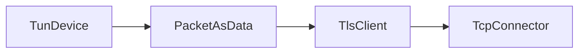
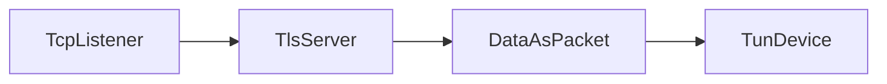
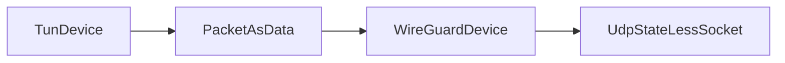
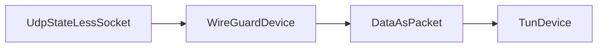
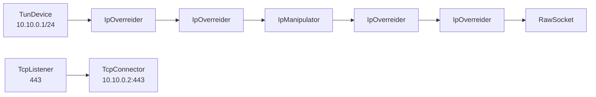
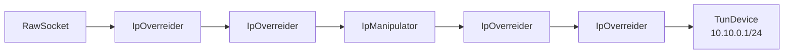

# آموزش بخش چهارم 

## دسته‌بندی Node ها 🔗

در واتروال ما Node ها را به **۳ گروه** تقسیم می‌کنیم:

### 📊 **دسته اول - Node های لایه ۴**
Node هایی هستند که با کانکشن کار می‌کنند. این نود ها لایه ۴ هستند (لایه ۷ هم می‌شه گفت که همون لایه اپلیکیشن هست)

**✅ مزایا:**
- این نود ها برای اجرا نیازی به دسترسی root ندارند
- کار کردن با آن‌ها ساده‌تر است

**📋 مثال‌های این دسته:**
- `TcpConnector/Listener`
- `UdpConnector/Listener`
- `HalfDuplexClient/Server`
- `ReverseClient/Server`

⚠️ **نکته مهم:** این نود ها نباید با نود های لایه ۳ در یک زنجیر قرار بگیرند، چون نود های لایه ۳ با پکت کار می‌کنند نه صرفاً روی کانکشن.

### 🌐 **دسته دوم - Node های لایه ۳**
Node هایی هستند که به لایه ۳ تعلق دارند و پکت‌های خام لایه IP را منتقل می‌کنند.

**📋 مثال‌های این دسته:**
- `TunDevice`
- `RawDevice`
- `IpOverreider`
- `IpManipulator`

⚠️ **نکته مهم:** این‌ها نباید با نود های لایه ۴ قاطی شوند یا زنجیر شوند.

### 🔄 **دسته سوم - Node های تبدیل‌گر**
Node هایی هستند که اگر داخل زنجیر بیایند، باعث می‌شوند که بتوانید نود های لایه ۳ و ۴ را همزمان در آن زنجیر به هم متصل کنید.

#### **مثال اول:** `PacketToConnection` 🔌
این نود برای پیاده کردن چیزی مثل TunMode روی کلاینت‌ها استفاده می‌شود و کاربردش تخصصی است.

**🔄 نحوه کار:**
- قبل از آن باید نود های لایه ۳ باشند
- بعد از آن نود های لایه ۴ قرار می‌گیرند
- همانطور که از اسمش پیداست، پکت هایی که از چپ به راست وارد می‌شوند را پردازش می‌کند
- متوجه می‌شود که سیستم عامل به کجا می‌خواهد کانکشن بزند
- بعد خودش همان کانکشن را ایجاد می‌کند داخل واتروال

#### **مثال دوم:** `PacketAsData` و `DataAsPacket` 📦
دو node زیر نیز به این دسته تعلق دارند:

**🔄 `PacketAsData`:**
- وقتی پکت‌ها از سمت چپ به راست حرکت می‌کنند، آن‌ها را در یک کانکشن قرار می‌دهد
- وقتی داده‌ها از راست به چپ حرکت می‌کنند، انتظار دارد که آن‌ها پکت باشند
- پکت‌ها را به سمت چپ منتقل می‌کند

- سمت راست این node باید لایه ۴ باشه و سمت چپش لایه ۳


**🔄 `DataAsPacket`:**
- دقیقاً همین کار را انجام می‌دهد فقط جهتش برعکس است
- سمت راست این node باید لایه ۳ باشه و سمت چپش لایه ۴

**🎯 کاربرد:** این نود ها برای زمانی هستند که شما چیزی مثل OpenVPN یا WireGuard می‌خواهید درست کنید.

---

## مثال عملی: OpenVPN 🔐

OpenVPN پکت‌ها را مستقیماً از یک tun device دریافت می‌کند و سپس آن‌ها را از یک کانکشن که با TLS رمز شده عبور می‌دهد. این‌طوری یک سناریو ساده و در عین حال قدرتمند ساخته می‌شود.

### 📱 **سمت کلاینت:** 



### 🖥️ **سمت سرور VPN:**



**💡 نکته:** حتی نیازی به تغییر IP ها هم ندارد. فقط یک کامند تولید NAT از دیتای TunDevice روی VPN Server اجرا می‌شود تا پکت‌ها به بیرون هدایت شوند.

همچنین یک کامند سمت کلاینت اجرا می‌شود که از سیستم عامل می‌خواهد تمام پکت‌ها را به TunDevice هدایت کند.


⚠️ **نکته درمورد OpenVPN:** الان یک node هنوز در زنجیر نیست که کامل شود و بتوانید پیاده‌اش کنید. آن هم نود احراز هویت‌کننده پروتکل OpenVPN است. این هنوز پیاده‌سازی نشده (الان که دارم این را می‌نویسم)، ولی WireGuard کامل است.

---

## مثال عملی: WireGuard 🚀

اگر شما با WireGuard آشنا باشید، آن نیز خیلی شبیه OpenVPN است، منتها چند نقطه قوت دارد که آن را به یکی از بهترین پروتکل‌ها در شرایط ایده‌آل (بدون فیلترینگ) تبدیل می‌کند:

### 🔥 **مزایای WireGuard:**
1. **📡 UDP:** از UDP برای انتقال دیتا استفاده می‌کند و برای همین پکت‌ها به صورت یکپارچه منتقل می‌شوند (البته با MTU کمتر)

2. **🔐 الگوریتم رمزنگاری مدرن:** بر مبنای رمزنگاری مدرن و مینیمال با محوریت `Curve25519` و `ChaCha20-Poly1305` ساخته شده است
   - سبک و CPU-friendly است
   - هندشیک کمتری نیاز دارد
   - امن است


### 📊 **ساختار WireGuard با واتروال:**

#### **سمت کلاینت:** 



#### **سمت سرور VPN:**


🤔 **سوال:** شاید برایتان این ساختار یکمی عجیب باشد، بخصوص اینکه سرور ایران شبیه سرور خارج شده است. باید بگویم WireGuard کلاً این‌طوری است!

**🔄 جهت برعکس:** اگر نود ها را برعکس بچینید هم همین سناریو درمی‌آید و درست کار می‌کند:

#### **سمت کلاینت (برعکس):**



#### **سمت سرور VPN (برعکس):**


### 🔍 **چرا UdpStateLessSocket؟**

علت اینکه از `UdpListener` / `UdpConnector` استفاده نشده این است که WireGuard ساختارش این‌گونه طراحی شده که از همان socket و پورتی که با آن پکت ارسال می‌کند، پکت هم دریافت می‌کند.

**❌ مشکل نود های قبلی:**
- `UdpListener` فقط گوش‌دهنده بود و نمی‌توانست شروع‌کننده باشد به یک peer
- `UdpConnector` فقط ارسال‌کننده بود و نمی‌توانست وقتی یک peer قبل از آن پکت داده، آن را پردازش کند

**✅ راه حل:** یک node جدید ساخته شد که از یک پورت هم بفرستد و هم گوش کند به اسم `UdpStateLessSocket`

📝 **نکته:** کامندهایی که باید تنظیم شوند دقیقاً مثل OpenVPN است و نکته دیگری ندارد.

### 📚 **منابع بیشتر:**

من ترجیح می‌دهم از اینجا به بعد فایل JSON برایتان نگذارم. به نظرم همان دیاگرام‌ها برای فهمیدن اینکه چطور باید بسازیدشان کافی است.

در صفحه **Examples** می‌توانید کامل‌تر درمورد ساختن سناریوهای WireGuard یا OpenVPN اطلاعات کسب کنید.


---

## تغییر و بازی با پکت‌ها 🎮

### 🚇 **سناریو Packet Tunnel**

اینجا می‌خواهم درمورد یک سناریو تونل توضیح دهم که اسمش **Packet Tunnel** است.

**📋 سناریو:** شما بین ۲ سرور (ایران و خارج) یک تونل برقرار می‌کنید که در این بین پکت‌ها به شکل غیرعادی و تغییر یافته منتقل خواهند شد.

### 🛠️ **کارهایی که می‌توان کرد:**

1. **🔀 جابه‌جا کردن بیت‌های TCP**
2. **🆔 تغییر identifier در هدر IP** تا به صورت جعلی به یکی از پروتکل‌های زیر تبدیل شود:
   - [📋 List Of IP Layer Protocols](https://en.wikipedia.org/wiki/List_of_IP_protocol_numbers)
3. **🧩 تکه‌تکه کردن پکت‌ها** (این حالت نیازی حتی به اجرای واتروال در سرور خارج ندارد)
4. **🔗 ترکیب این حالت‌ها**

**💡 نکته:** شما می‌توانید ۲ یا چند نود از نوع `IpManipulator` به هم زنجیر کنید و در هر کدام یک تغییر به پکت لایه IP بدهید. ولی روی یک Node فقط می‌شود یک ترفند روی پکت اجرا کرد، نه بیشتر.

### 📖 **مثال آموزشی: تغییر Identifier**

چیزی که من برای آموزش در نظر گرفتم، حالت ساده **تغییر identifier** است:

#### **🇮🇷 سرور ایران:**




#### **🌍 سرور خارج:**



### 🤔 **سوال: چرا این‌همه IpOverreider؟**

اولین سوال که برایتان پیش می‌آید این است که این همه node از نوع `IpOverreider` برای چی هستند؟

در سرور ایران توضیح می‌دهم (برای سرور خارج هم علتش همین است):

### 🔒 **مشکل امنیتی آیپی مبدا پکت ها:**
اگر شما یک پکت به بیرون از سرور ارسال کنید که IP مبدایش IP خود سرور نباشد، پکت drop می‌شود توسط دیتاسنتر به خاطر جلوگیری از DDoS.

### 🎯 **وظیفه هر IpOverreider:**

#### **📤 نودهای UP (چپ به راست):**
1. **نود اول:** IP مبدا پکتی که از tun device گرفته را IP خود سرور قرار می‌دهد
2. **نود دوم:** IP مقصد را برابر با IP سرور خارج قرار می‌دهد (چون پکت‌ها IP مقصدشان وقتی دریافت می‌شوند `10.10.0.2` هستند)

#### **📥 نودهای DOWN (راست به چپ):**
در تنظیمات ۲ نود دیگر، `direction = down` تنظیم شده است. این یعنی این ۲ نود فقط پکت هایی را کار دارند که از راست به چپ می‌آیند.

**🔄 تغییرات مورد نیاز:**
- این پکت‌ها دقیقاً مشکل IP دارند
- IP مبدا: IP سرور خارج ← باید بشود `10.10.0.2`
- IP مقصد: IP سرور ایران ← باید بشود IP خود tun device که `10.10.0.1` است

**💡 هدف:** ما داریم tun device را کاملاً شبیه‌سازی می‌کنیم به یک دستگاهی که به صورت جادویی ارتباطی با دنیای بیرون برقرار می‌کند!

### ⚙️ **نود IpManipulator:**

ما به این نود می‌گوییم که باید **تغییر identifier** انجام دهد. این کار با تنظیماتش انجام می‌شود.

**🔄 protoswap-tcp:** یعنی هر پکتی که از نوع TCP بود را تغییر به آن عددی که گفته شده، و در پکت‌های برگشتی هم هر پکتی از آن عدد بود تغییر می‌کند به TCP.


این نود هم می‌تواند دریافت و هم ارسال کند. برای همین در این سناریو هم اگر کل زنجیر را برعکس بچینید، درست کار می‌کند.

**🔧 نحوه کار:**
- برای ارسال: از یک raw socket استفاده می‌کند
- برای دریافت: از فایروال کمک می‌گیرد تا پکت‌های دریافتی به هیچ وجه دست سیستم عامل نرسند

**⚠️ چرا مهم است؟** در غیر این صورت سیستم عامل خود (مثلاً با TCP-reset) پاسخ می‌داد و نمی‌شد با همان socket دریافت کرد.

**💻 ویندوز:** در سیستم عامل ویندوز همین کار با استفاده از driver انجام می‌شود.

### 🎉 **نتیجه:**

پس از برقراری تونل در سرور ایران، IP `10.10.0.2` را می‌توان IP خارج فرض کرد که ارتباط با آن از فیلترینگ عبور کرده و حتی می‌شود ping گرفت! 🏓

**🚀 پورت فوروارد:** ما در سرور ایران پورت ۴۴۳ هم به این IP فوروارد کردیم، ولی شما می‌توانید:
- از iptables برای پورت فوروارد استفاده کنید
- یا اگر پنل روی سرور ایران نصب است، یک تونل outbound برقرار کنید

**🌍 سرور خارج:** IP `10.10.0.2` انگار شده IP سرور ایران و می‌توانید با آن ارتباط داشته باشید.

---

## 📄 **فایل JSON**

من فایل JSON این روش را برایتان همینجا قرار خواهم داد. 

### 🇮🇷 **سرور ایران:**

```json
{
    "name": "my tun",
    "type": "TunDevice",
    "settings": {
        "device-name": "wtun0",
        "device-ip": "10.10.0.1/24"
    },
    "next": "ipovsrc"
},
{
    "name": "ipovsrc",
    "type": "IpOverrider",
    "settings": {
        "direction": "up",
        "mode": "source-ip",
        "ipv4": "IP_IRAN"
    },
    "next": "ipovdest"
},
{
    "name": "ipovdest",
    "type": "IpOverrider",
    "settings": {
        "direction": "up",
        "mode": "dest-ip",
        "ipv4": "IP_KHAREJ"
    },
    "next": "manip"
},
{
    "name": "manip",
    "type": "IpManipulator",
    "settings": {
        "protoswap-tcp": YOUR_DESIRED_PROTOCOL
    },
    "next": "ipovsrc2"
},
{
    "name": "ipovsrc2",
    "type": "IpOverrider",
    "settings": {
        "direction": "down",
        "mode": "source-ip",
        "ipv4": "10.10.0.2"
    },
    "next": "ipovdest2"
},
{
    "name": "ipovdest2",
    "type": "IpOverrider",
    "settings": {
        "direction": "down",
        "mode": "dest-ip",
        "ipv4": "10.10.0.1"
    },
    "next": "rd"
},
{
    "name": "rd",
    "type": "RawSocket",
    "settings": {
        "capture-filter-mode": "source-ip",
        "capture-ip": "IP_KHAREJ"
    }
},
{
    "name": "input",
    "type": "TcpListener",
    "settings": {
        "address": "0.0.0.0",
        "port": 443,
        "nodelay": true
    },
    "next": "output"
},
{
    "name": "output",
    "type": "TcpConnector",
    "settings": {
        "nodelay": true,
        "address": "10.10.0.2",
        "port": 443
    }
}
```

📝 **نکات مهم:**
- در این فایل باید IP سرور خارج و ایران را قرار دهید
- به جای `YOUR_DESIRED_PROTOCOL` یک عدد بین ۰ تا ۲۵۵ قرار دهید

### 🚨 **هشدار امنیتی:**
- برخی اعداد ریسک فیلتر شدن IP سرور خارج در ۱ روز را دارند (معمولاً بالای ۴۰)
- برخی اعداد تونل را بی‌معنی می‌کنند مثل عدد ۶ (TCP) و عدد ۱۷ (UDP)

**🔰 درمورد عدد ۱:**
- استفاده از عدد ۱ باعث تبدیل شدن به **ping tunnel** می‌شود
- این عدد ریسک فیلترینگ دارد در ترافیک بالا
- ولی در شرایط نت ملی می‌تواند نجات‌بخش باشد

### 📋 **پروتکل‌های IP:**
- [📋 List Of IP Layer Protocols](https://en.wikipedia.org/wiki/List_of_IP_protocol_numbers)


### 📡 **پشتیبانی از UDP:**

این روش در حال حاضر فقط پکت‌های TCP را ویرایش می‌کند چون ما از `protoswap-tcp` استفاده کرده‌ایم. اگر قصد دارید UDP هم عبور دهید:

**🔧 راه حل:**
- مقدار `protoswap-udp` را هم اضافه کنید به تنظیمات `IpManipulator`
- این برای عبور دادن کانفیگ‌هایی مثل WireGuard یا L2TP استفاده می‌شود
- می‌توانید با آن کانفیگ‌های مناسب گیم درست کنید

دقت کنید مقدار protoswap-udp با protoswap-tcp نباید یکی باشه!⚠️

### 🏓 **مثال عملی:**


⚠️ **نکته:** تنظیمات IpManipulator در سرور ایران و خارج دقیقاً باید یکی باشد

### 🌍 **سرور خارج:**

```json
{
    "name": "rd",
    "type": "RawSocket",
    "settings": {
        "capture-filter-mode": "source-ip",
        "capture-ip": "IP_IRAN"
    },
    "next": "ipovsrc"
},
{
    "name": "ipovsrc",
    "type": "IpOverrider",
    "settings": {
        "direction": "down",
        "mode": "source-ip",
        "ipv4": "IP_KHAREJ"
    },
    "next": "ipovdest"
},
{
    "name": "ipovdest",
    "type": "IpOverrider",
    "settings": {
        "direction": "down",
        "mode": "dest-ip",
        "ipv4": "IP_IRAN"
    },
    "next": "manip"
},
{
    "name": "manip",
    "type": "IpManipulator",
    "settings": {
        "protoswap-tcp": "YOUR_DESIRED_PROTOCOL"
    },
    "next": "ipovsrc2"
},
{
    "name": "ipovsrc2",
    "type": "IpOverrider",
    "settings": {
        "direction": "up",
        "mode": "source-ip",
        "ipv4": "10.10.0.2"
    },
    "next": "ipovdest2"
},
{
    "name": "ipovdest2",
    "type": "IpOverrider",
    "settings": {
        "direction": "up",
        "mode": "dest-ip",
        "ipv4": "10.10.0.1"
    },
    "next": "my tun"
},
{
    "name": "my tun",
    "type": "TunDevice",
    "settings": {
        "device-name": "wtun0",
        "device-ip": "10.10.0.1/24"
    }
}
```

📝 **نکته:** اگر آموزش ۳ را ندیده‌اید، این فایل‌های JSON را باید داخل بخش `nodes` در کانفیگ فایلی که ساخته‌اید قرار دهید.

---

## 🔄 **ترفند نوع دوم: جابه‌جایی Flag های TCP**

در همین حالت تونلی که اجرا کردیم، می‌توانیم روش را عوض کنیم و به جای تغییر identifier، بیت‌های flag های TCP را با هم جابه‌جا کنیم.

**🎯 هدف:** این‌طوری فایروال و کلاً سیستم‌های میانی هیچ درکی نمی‌توانند از کانکشن پیدا کنند.

### 🏷️ **Flag های TCP:**

شما بیت‌های زیر را در اختیار دارید:

| Flag | نام کامل | معنی |
|------|-----------|------|
| `cwr` | Congestion Window Reduced | نشان‌دهنده کاهش پنجره ازدحام |
| `ece` | ECN-Echo | نشان‌دهنده اعلام ازدحام صریح |
| `urg` | Urgent | نشان‌دهنده داده‌های اضطراری |
| `ack` | Acknowledgment | تأیید دریافت داده‌ها |
| `psh` | Push | درخواست ارسال فوری داده‌ها |
| `rst` | Reset | بازنشانی کانکشن |
| `syn` | Synchronize | شروع کانکشن |
| `fin` | Finish | پایان کانکشن |

### ⚙️ **مقادیر قابل استفاده:**

برای تغییر هر بیت می‌توانید از مقادیر زیر استفاده کنید:

نکته موقت: 
الان که دارید این رو میخونید نسخه 1.40 منتشر شده که من بعدش اومدم توی تنظیمات اسم های مربوط به این روش رو اپدیت کردم به چیزی که
این پایین هست ؛ پس بهتره برا این روش موقتا نسخه رو از 
[اکشن گیت هاب](https://github.com/radkesvat/WaterWall/actions/runs/16782085024)
دانلود کنید.


```
"off", "on", "packet->cwr", "packet->ece", "packet->urg", "packet->ack", "packet->psh", "packet->rst", "packet->syn", "packet->fin"
```


### 🛠️ **پیاده‌سازی:**

این کار خیلی ساده است. در سرور ایران کافی است نود `IpManipulator` را به این شکل تغییر دهید:

**مثال:** جابه‌جایی flag های `ack` و `fin`:

### 🇮🇷 **سرور ایران:**

```json
{
    "name": "manip",
    "type": "IpManipulator",
    "settings": {
        "up-tcp-bit-ack": "packet->fin",
        "up-tcp-bit-fin": "packet->ack",

        "dw-tcp-bit-fin": "packet->ack",
        "dw-tcp-bit-ack": "packet->fin"
    },
    "next": "ipovsrc2"
}
```

**📝 توضیحات:**

- **up:** تنظیمات پکت‌هایی که از سمت چپ به راست این نود حرکت می‌کنند
- **dw:** تنظیمات پکت‌هایی که از سمت راست به چپ این نود حرکت می‌کنند

**⚡ نکته مهم:** عملیات تغییر بیت‌ها در پکت همزمان انجام می‌شود و خط به خط نیست.

**🔄 مثال:**
- `"up-tcp-bit-ack": "packet->fin"` یعنی بیت `ack` مقدارش از بیت `fin` پکت اصلی خوانده شود
- پکت اصلی تا پایان عملیات تغییر نمی‌کند، بنابراین در خط بعدی می‌توانیم از مقدار `ack` پکت اصلی برای ساختن بیت `fin` پکت جدید استفاده کنیم


### 🌍 **سرور خارج:**

```json
{
    "name": "manip",
    "type": "IpManipulator",
    "settings": {
        "up-tcp-bit-ack": "packet->fin",
        "up-tcp-bit-fin": "packet->ack",

        "dw-tcp-bit-fin": "packet->ack",
        "dw-tcp-bit-ack": "packet->fin"
    },
    "next": "ipovsrc2"
}
```

**📋 نکات پیاده‌سازی:**

- کانفیگ سرور خارج مشابه ایران می‌شود
- اگر کانفیگ سرور خارج را به صورت برعکس چیده باشید، باید جهت‌ها را برعکس کنید که البته ما در آموزش‌هایی که دادیم جهت همیشه چپ به راست است


الان برای استفاده از این روشی که آموزش دادیم کافی است تنظیمات IpManipulator را در همان مثال packet tunnel که بالا گفتیم مطابق آموزش عوض کنید


**⚠️ هشدار:** هر نود `IpManipulator` را برای یک ترفند استفاده کنید. تنظیمات ۲ ترفند را در یک نود قرار ندهید.

**📋 لیست ترفند‌ها:**

1. **🔄 protoswap:** همان روش packet tunnel که بالا گفتیم
2. **🏷️ tcp bit changes:** که اینجا توضیح دادیم تنظیماتش چگونه است  
3. **🧩 sni-blender:** که در ادامه توضیح خواهم داد


شما می‌توانید هر چند تا نود IpManipulator بسازید و به هم زنجیر کنید و در هر کدام ترفندهای متفاوتی را اعمال کنید


---

## 🧩 **ترفند تکه‌تکه کردن پکت‌ها (SNI Blender)**

همچنین می‌توانید با همین نود `IpManipulator` پکت‌های `TlsClientHello` را تکه‌تکه کنید به پکت‌های لایه IP.

### 🎯 **کاربردها:**
- 🔒 برای تونل زدن، دامنه خود را مخفی کنید
- ☁️ به CloudFlare تونل بزنید
- 🌐 در حالت سرور لس، سایت‌های پشت CDN مثل یوتیوب را باز کنید

### 🔄 **تفاوت با روش‌های دیگر:**
این روش با fragmenting که `gfw-knocker` معرفی کرده متفاوت است.

### ⚙️ **نحوه کار:**
1. پکت `client-hello` به پکت‌های لایه IP تکه‌تکه می‌شود
2. بعد با ترتیب رندوم ارسال می‌شود
3. تعداد پکت‌ها در تنظیمات قابل تنظیم است (عدد ۴ معمولاً خوب است)

### 📊 **تست‌های انجام شده:**
- ❌ **همراه اول:** در برخی فایروال‌ها این نوع پکت کلاً drop می‌شود
- ✅ **ایرانسل:** باعث باز شدن سایت‌های فیلتر پشت CDN شد (یوتیوب و غیره)
- 🖥️ **تست روی ویندوز:** چون نیازی به سرور نداشت

⚠️ **هشدار:** روی همه‌جا جواب نمی‌دهد، ولی روش جدیدی است.

### 🛠️ **پیاده‌سازی:**

برای این کار در سرور خارج واتروال نباید کاری انجام دهد. در سرور ایران کانفیگ شما عادی به پورت ۴۴۳ سرور خارج وصل می‌شود.

⚠️ **نیاز:** کانفیگی که دست کاربر دارید باید TLS داشته باشد. اگر ندارد، باید در واتروال به زنجیر نودهای `TlsClient/TlsServer` اضافه کنید.

در کل یعنی سرور ایران باید به سرور خارج اتصال TLS برقرار کند تا این ترفند بتواند دامنه را پیدا کند و تکه‌تکه کند.

اگر توی خود Xray TLS فعال باشد که یعنی کانفیگ دست کاربر هم TLS است و نیازی نیست واتروال در سرور خارج اجرا شود

و در غیر این صورت باید TLS tunnel بسازید با واتروال که نیاز می‌شود در سرور خارج هم ران باشد برای نود TlsServer

اگر به کلودفلیر می‌خواهید تونل بزنید، واتروال فقط در سرور ایران نیاز است که اجرا شود

امیدوارم منظورم از این بخش را خوب رسانده باشم؛ درک این نیازمند کمی شناخت بیشتر از شبکه و TLS است

شما با دادن لینک این آموزش به چت GPT، می‌توانید از بخش‌های مختلف از آن سوال کنید تا جزییات کاملی به‌تان بدهد

### 🇮🇷 **مثال سرور ایران:**

```json
{
    "name": "my tun",
    "type": "TunDevice",
    "settings": {
        "device-name": "wtun0",
        "device-ip": "10.10.0.1/24"
    },
    "next": "ipovsrc"
},
{
    "name": "ipovsrc",
    "type": "IpOverrider",
    "settings": {
        "direction": "up",
        "mode": "source-ip",
        "ipv4": "IP_IRAN"
    },
    "next": "ipovdest"
},
{
    "name": "ipovdest",
    "type": "IpOverrider",
    "settings": {
        "direction": "up",
        "mode": "dest-ip",
        "ipv4": "IP_KHAREJ"
    },
    "next": "manip"
},
{
    "name": "manip",
    "type": "IpManipulator",
    "settings": {
        "sni-blender": true,
        "sni-blender-packets": 4
    },
    "next": "ipovsrc2"
},
{
    "name": "ipovsrc2",
    "type": "IpOverrider",
    "settings": {
        "direction": "down",
        "mode": "source-ip",
        "ipv4": "10.10.0.2"
    },
    "next": "ipovdest2"
},
{
    "name": "ipovdest2",
    "type": "IpOverrider",
    "settings": {
        "direction": "down",
        "mode": "dest-ip",
        "ipv4": "10.10.0.1"
    },
    "next": "rd"
},
{
    "name": "rd",
    "type": "RawSocket",
    "settings": {
        "capture-filter-mode": "source-ip",
        "capture-ip": "IP_KHAREJ"
    }
},

{
    "name": "input",
    "type": "TcpListener",
    "settings": {
        "address": "0.0.0.0",
        "port": 443,
        "nodelay": true
    },
    "next": "output"
},
{
    "name": "output",
    "type": "TcpConnector",
    "settings": {
        "nodelay": true,
        "address": "10.10.0.2",
        "port": 443
    }
}
```

📝 **نکته:** اینجا فقط لازم است IP سرور ایران و خارج را قرار دهید.

### 💻 **استفاده در ویندوز:**
شما در حالت سرور لس هم می‌توانید همین کانفیگ را روی ویندوز اجرا کنید، ولی باید:
- روتینگ ویندوز را تغییر دهید (کامند دارد)
- پکت‌های دریافتی از IP های مختلف را capture کنید

### 🚧 **وضعیت توسعه در ویندوز:**

**🔧 وضعیت فعلی:** فعلاً به صورت دستی برای تست انجام داده‌ام، ولی چون کد کامل نیست، توضیحش نمی‌دهم تا نسخه بعدی منتشر شود.

---

## 🎓 **نتیجه‌گیری**

اگر تا اینجا همراهی کرده باشید، فکر می‌کنم کارکرد کلی را متوجه شده‌اید! 🎉

### 📚 **مطالعه بیشتر:**
- برای اطلاعات بیشتر باید صفحه‌های **Examples** یا **Nodes** را مطالعه کنید
- برای برنامه‌نویسان documentation قرار خواهد گرفت تا بتوانند ایده‌های خود را اضافه کنند

**🚀 موفق باشید!**