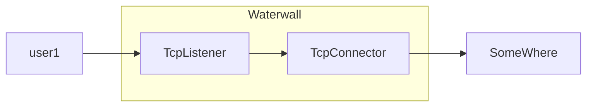
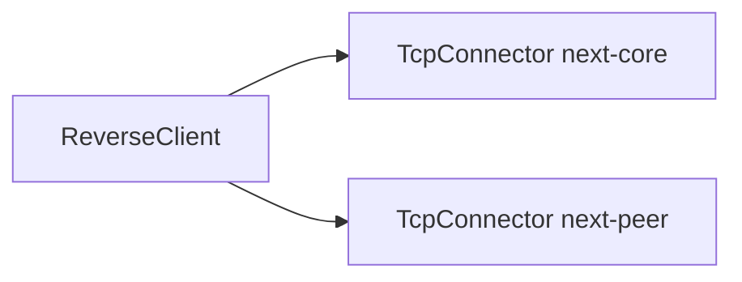
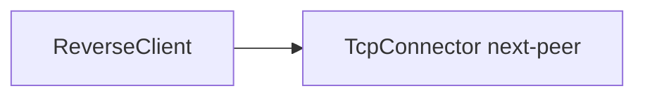
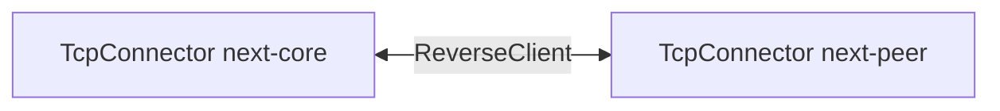
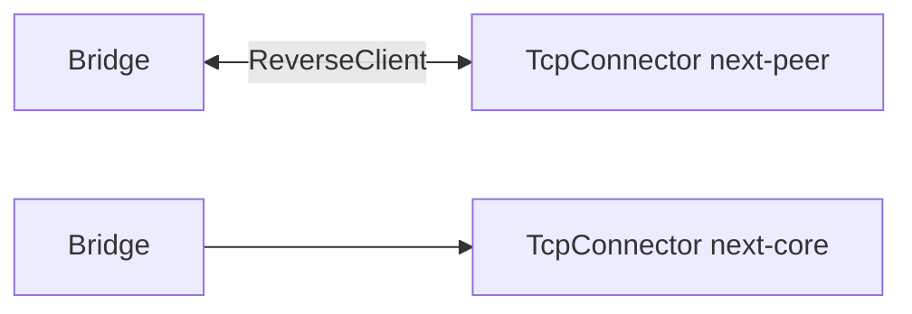
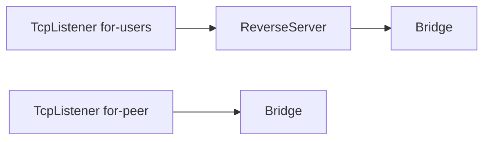

# Bridge

## 📖 معرفی کلی

| ویژگی              | مقدار                       | توضیح                                                                 |
|--------------------|-----------------------------|------------------------------------------------------------------------|
| نوع نود            | Tunnel (چندجهته)            | جهت برای این تونل بی‌معناست.                                            |
| لایه شبکه          | تمام لایه ها   | با داده به‌صورت خام کار می‌کند و «اتصال» برایش معنا ندارد.            |
| جهت پشتیبانی       | دو‌جهته                     | جهت این نود به خودِ داده و زنجیره‌ای که در آن قرار گرفته بستگی دارد.   |
| موقعیت در زنجیره   | ابتدا یا انتهای زنجیره      | فقط در ابتدا یا انتهای یک زنجیره قابل استفاده است.                     |
| وابستگی            | وابسته به جفت و همسایه‌ها   | اگر در انتهای زنجیره باشد به نود قبلی و اگر در ابتدای زنجیره باشد به نود بعدی وابسته است؛ خودش صرفاً داده را عبور می‌دهد. |

## عملکرد

در زمان نگارش این مستند، این نود عملاً برای ساخت تونل معکوس (Reverse Tunnel) استفاده می‌شود و احتمال کمی دارد که در سناریوهای دیگر به آن نیاز داشته باشید.

در اغلب نودهای لایهٔ انتقال واتروال، جهت حرکت «چپ 🡐 راست» است؛ یعنی اتصال‌ها از چپ شروع شده و به سمت راست ادامه پیدا می‌کنند.

ساده‌ترین نمونه، «پورت فورواردینگ» است که چنین نمایش داده می‌شود:



حال ببینیم چرا Bridge طراحی شد. برای ساخت تونل معکوس با دو چالش روبه‌رو بودیم؛ نخست در حالت کلاینت:

- در کانفیگ سمت سرور خارج (حالت کلاینت)، نود ReverseClient باید فقط «اتصال ایجاد کند»؛ یعنی هیچ نودِ Listener نداریم.
- از یک ReverseClient به دو مقصد نیاز داریم؛ اما در ساختار تنظیمات، معمولاً فقط یک فیلد `next` وجود دارد.

### ایدهٔ اول (رد شده)

این بود که ReverseClient دو `next` داشته باشد و آن‌ها را در تنظیمات داخلی نود (بخش `settings`) تعریف کنیم، نه در سطح بیرونی که تنها یک `next` دارد. چیزی شبیه به:

```json
{
    "name": "node_name",
    "type": "ReverseClient",
    "settings": {
        "next-core": "next_core_node_name", // xray core inbound
        "next-peer": "next_peer_node_name"   // server iran
    }
}
```



این ایده جذاب نبود؛ ترجیح دادیم همچنان از همان `next` استاندارد استفاده کنیم.

---

## ایدهٔ دوم (پذیرفته‌شده)

در این ایده از `next` برای مسیر «peer» استفاده می‌کنیم؛ یعنی مسیری که به ReverseServer می‌رسد:

```json
{
    "name": "node_name",
    "type": "ReverseClient",
    "settings": {
    },
    "next": "next_peer_node_name"  // server iran
}
```



اما نود متصل‌شونده به مقصد نهایی (مثلاً xray) کجا قرار بگیرد؟ می‌خواستیم آن را «پشت» ReverseClient بگذاریم:

```json
{
    "name": "outbound_xray",
    "type": "TcpConnector",
    "settings": {
        "address": "127.0.0.1",
        "port": 1234
    }
},
{
    "name": "node_reverse_client_name",
    "type": "ReverseClient",
    "settings": {
    },
    "next": "next_peer_node_name"  // server iran
}
```



اما این منطقی نیست؛ چون تقریباً همهٔ نودهای لایهٔ انتقال جهت‌شان «چپ 🡐 راست» است، در حالی که اینجا می‌خواهیم از «راست 🡐 چپ» حرکت کنیم. پس به نودی نیاز داریم که «جهت» را معکوس کند؛ نودی با دو مسئولیت روشن:

- اگر در ابتدای مسیر باشد: هر داده‌ای را که از راست به چپ می‌گیرد، به چپ 🡐 راست منتقل کند.
- اگر در انتهای زنجیره باشد: هر داده‌ای را که از چپ به راست می‌آید، به راست 🡐 چپ برگرداند.

این دقیقاً همان چیزی است که Bridge انجام می‌دهد.



و اگر در انتهای زنجیره باشد (سناریوی ReverseServer):



به این ترتیب، Bridge به‌وجود آمد. در تنظیمات، نام «جفت» خود را می‌گیرد و با آن جفت می‌شود؛ هر داده‌ای که وارد یک Bridge شود، انگار وارد جفتش شده اما در «جهت مخالف» خارج می‌شود.

## ⚙️ راهنمای پیکربندی

```json
{
    "name": "b1",
    "type": "Bridge",
    "settings": {
        "pair": "b2"
    },
    "next": "next_node_name" // optional (when making reverse client)
},

{
    "name": "b2",
    "type": "Bridge",
    "settings": {
        "pair": "b1"
    },
    "next": "next_node_name" // optional (when making reverse client)
}
```

نکات:
- این نود همیشه به‌صورت زوج استفاده می‌شود، چون به «جفت» خود نیاز دارد.
- دقیقاً مثل یک آینه عمل می‌کند: هرچه دریافت کند، به جفتش می‌فرستد تا در جهت مخالف ارسال شود.

---

با Bridge، سناریوی ReverseClient کامل می‌شود: از سمت `next` اتصال به سرور همتا (peer) برقرار می‌کنیم و از سمت «عقب» به هسته (مثلاً xray) وصل می‌شویم.


### مثال کامل JSON برای ReverseClient

```json
{
    "name": "outbound_to_core",
    "type": "TcpConnector",
    "settings": {
        "nodelay": true,
        "address": "127.0.0.1",
        "port": 443
    }
},

{
    "name": "bridge1",
    "type": "Bridge",
    "settings": {
        "pair": "bridge2"
    },
    "next": "outbound_to_core"
},

{
    "name": "bridge2",
    "type": "Bridge",
    "settings": {
        "pair": "bridge1"
    },
    "next": "reverse_client"
},

{
    "name": "reverse_client",
    "type": "ReverseClient",
    "settings": {
        "minimum-unused": 4
    },
    "next": "outbound_to_iran"
},

{
    "name": "outbound_to_iran",
    "type": "TcpConnector",
    "settings": {
        "nodelay": true,
        "address": "1.1.1.1",
        "port": 443
    }
}
```
