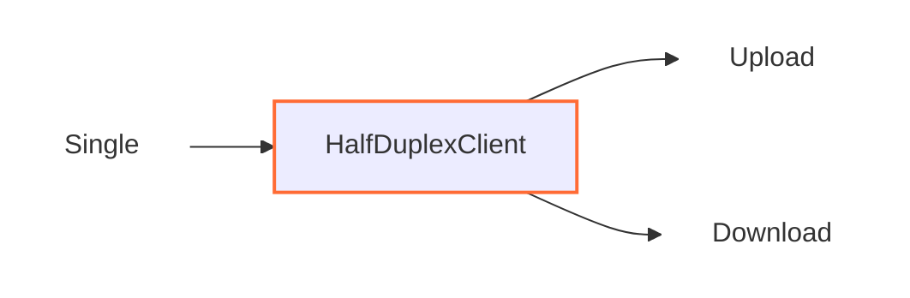

# HalfDuplexClient

## 📖 معرفی کلی

| ویژگی              | مقدار                        | توضیح                                              |
|--------------------|------------------------------|----------------------------------------------------|
| **نوع نود**        | Tunnel (تک‌جهته)            | جهت کانکشن ها از چپ شروع و به راست پیش روی می‌کنند              |
| **لایه شبکه**      | لایه ۴ (Transport Layer)     | کار با کانکشن‌ها، نه پکت‌های خام                   |
| **جهت پشتیبانی**  | چپ به راست (Left to Right)   | دوجهته نیست، فقط یک‌طرفه                          |
| **موقعیت در زنجیر**| وسط زنجیر                 | فقط در وسط زنجیر قابل استفاده است               |
| **وابستگی**        | نیاز به حداقل یک نود قبلی و بعدی     | برای دریافت داده‌ها ضروری است                      |

## عملکرد



این نود با کانکشن‌ها کار می‌کند.

هر کانکشنی که از چپ شروع می‌شود، در این نود برایش ۲ کانکشن ساخته می‌شود که یکی برای آپلود و یکی برای دانلود استفاده می‌شود.

این یعنی ۳ کانکشن می‌شود؛ با بسته شدن هرکدام از این ۳ کانکشن، کانکشن‌های جفت شده بسته می‌شوند.

این نود به دیتای اولی که ازش رد میشه 8 بایت اضافه میکنه (به صورت تلفیق شده با دیتایی که از قبل اومده نه اینکه پکت جدا بفرسته)


دیتایی که از قبل اومده وارد کانکشن آپلود شده و ارسال شده (به همراه اون ۸ بایت)

و برای کانکشن دانلود فقط یه ۸ بایت به صورت خالی استفاده میشه

شما میتوانید جلوی این نود مثلا یه TlsClient قرار بدید تا روی هر دوتا کانکشن هند شیک Tls داشته باشید و سایر ایده ها

---

## ⚙️ راهنمای پیکربندی

```json
{
    "name": "node_name",
    "type": "HalfDuplexClient",
    "settings": {},
    "next": "next_node_name"
}
```

این نود در حال حاضر تنظیماتی نیاز ندارد؛ هر دو کانکشن آپلود و دانلود به نود بعدی که با `next` مشخص شده در JSON ارسال می‌شود.

در نسخه‌های بعدی WaterWall به این نود قابلیت ارسال به تونل‌های مجزا اضافه می‌شود که مثلاً بتوانید با آن کانکشن دانلود را به یک node و آپلود را به یک node دیگر بفرستید.

با این قابلیت می‌توانید تونل‌های مثلثی و پیشرفته‌تر درست کنید.

---

## نکته مهم

شما باید جایی بعد از این نود، یک نود `HalfDuplexServer` داشته باشید تا هر دو کانکشن آپلود و دانلود به آن برسند و به هم پیوند بزند.


