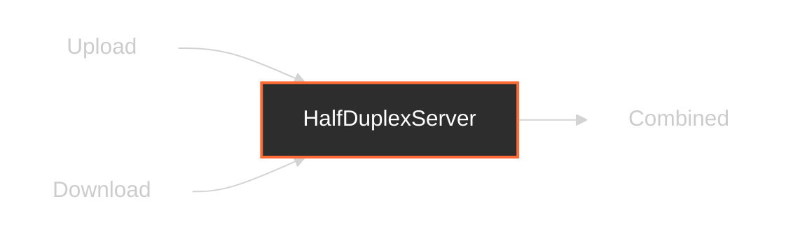

# HalfDuplexServer

## 📖 معرفی کلی

| ویژگی              | مقدار                        | توضیح                                              |
|--------------------|------------------------------|----------------------------------------------------|
| **نوع نود**        | Tunnel (تک‌جهته)            | فقط از جهت چپ به راست پشتیبانی می‌کند              |
| **لایه شبکه**      | لایه ۴ (Transport Layer)     | کار با کانکشن‌ها، نه پکت‌های خام                   |
| **جهت پشتیبانی**  | چپ به راست (Left to Right)   | دوجهته نیست، فقط یک‌طرفه                          |
| **موقعیت در زنجیر**| وسط زنجیر                 | فقط در وسط زنجیر قابل استفاده است               |
| **وابستگی**        | نیاز به حداقل یک نود قبلی و بعدی     | برای دریافت داده‌ها ضروری است                      |


---

## عملکرد



این نود کانکشن‌های قبلی را نگاه کرده و از داده‌ای که HalfDuplexClient در شروع هر کانکشن گذاشته، متوجه ماهیت آن می‌شود.

سایز این داده ۶۴ بیت است که فقط در اولین پکت ارسالی از HalfDuplexClient اضافه شده است.

سپس کانکشن‌های دانلود و آپلود پیوند خورده و یک کانکشن تشکیل می‌دهند که به نود بعدی متصل می‌شود.

این نود قابلیت pipe داخلی دارد و به طور خلاصه، اگر کانکشن‌های آپلود و دانلود به دست ۲ ورکر مجزا بیفتند، باز هم بدون مشکل به هم متصل می‌شوند.

---

## ⚙️ راهنمای پیکربندی

```json
{
    "name": "node_name",
    "type": "HalfDuplexServer",
    "settings": {},
    "next": "next_node_name"
}
```

این نود در حال حاضر تنظیماتی نیاز ندارد.

---

## نکته 


قبل این نود باید یه جایی HalfDuplexClient استفاده کرده باشید.

