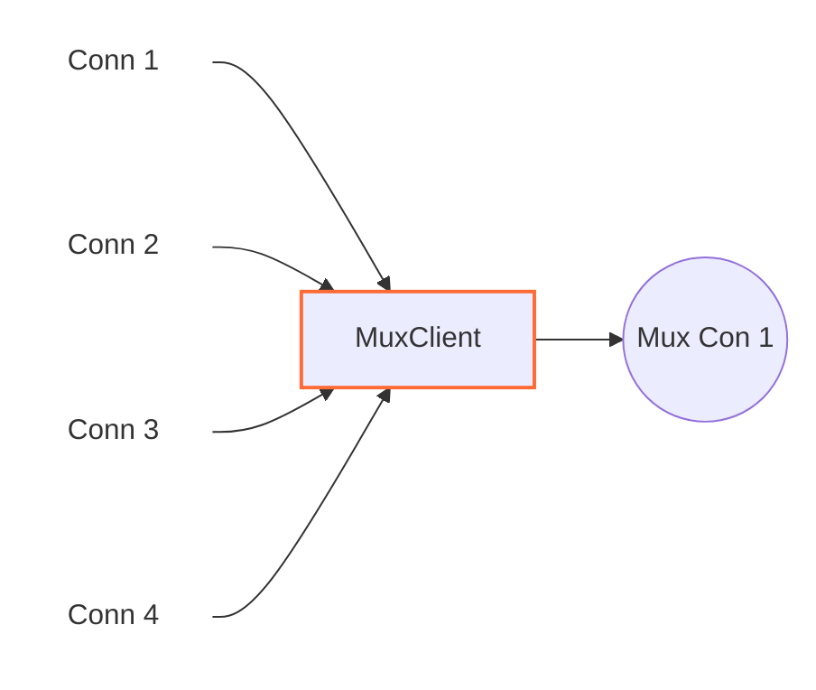

# MuxClient

## 📖 معرفی کلی

| ویژگی              | مقدار                      | توضیح                                                    |
|--------------------|----------------------------|----------------------------------------------------------|
| **نوع نود**        | Tunnel (تک‌جهته)           | جهت کانکشن‌ها از چپ شروع می‌شود و به راست پیش‌روی می‌کند |
| **لایه شبکه**      | لایه ۴ (Transport Layer)   | کار با کانکشن‌ها، نه بسته‌های خام                        |
| **موقعیت در زنجیر**| وسط زنجیر                  | فقط در میانه زنجیر قابل استفاده است                     |
| **وابستگی**        | نیاز به حداقل یک نود قبلی و بعدی | برای دریافت و ارسال داده‌ها ضروری است                 |

---




## عملکرد

این نود کانکشن‌هایی را که از سمت چپ وارد می‌شوند، بسته به تنظیمات، داخل یک کانکشن ادغام می‌کند.
به این فرایند Multiplexing (مَکس‌کردن) گفته می‌شود.

این رفتار دو حالت دارد که در فایل JSON تنظیم می‌کنید؛ در ادامه توضیح داده شده است.

---

## ⚙️ راهنمای پیکربندی

```json
{
    "name": "node_name",
    "type": "MuxClient",
    "settings": {
        "mode": ""
    },
    "next": "next_node_name"
}
```

ابتدا باید در تنظیمات نود، مقدار `mode` را مشخص کنید. این مقدار دو حالت دارد:

### حالت اول: `counter`

```json
"mode": "counter"
```

این حالت رایج‌ترین شیوه استفاده از این نود است و به این معناست که تعداد مشخصی کانکشن در یک کانکشن
تجمیع شوند.

وقتی از این حالت استفاده می‌کنید، لازم است تنظیم زیر را هم اضافه کنید:

```json
"connection-capacity": <number>
```

در اینجا تعداد کانکشن‌هایی را که می‌خواهید در یک کانکشن جا شوند مشخص می‌کنید.

مثلاً اگر عدد 8 را وارد کنید، تا 8 کانکشن مَکس می‌شوند؛ پس از آن کانکشن جدید ساخته می‌شود و مجدداً تا 8 کانکشن در آن پر می‌شود.

### حالت دوم: `timer`

```json
"mode": "timer"
```

در این حالت برای هر کانکشن «فرصت زمانی» تعیین می‌کنید؛ تا زمانی که این فرصت برقرار است، کانکشن‌های جدید در همان کانکشن قبلی جا می‌گیرند و ادغام می‌شوند.

در این حالت باید تنظیم زیر را هم اضافه کنید:

```json
"connection-duration": <number>
```

عدد را بر حسب میلی‌ثانیه قرار دهید؛ مثلاً اگر `60000` تنظیم شود یعنی تا 60 ثانیه تمام کانکشن‌ها یکی می‌شوند و پس از آن کانکشن جدید ساخته می‌شود.

این حالت برای شرایطی مناسب است که فیلترینگ سخت‌گیرانه‌تر است؛ توضیحات تکمیلی را در ادامه بخوانید.

---

## نکات بهینه‌سازی و عملکرد

Multiplex کردن کانکشن‌ها برای کاهش ریسک فیلترینگ مفید است؛ اما باید توجه داشت هرچه تعداد بیشتری کانکشن ادغام شوند،
کیفیت و سرعت ممکن است تحت تأثیر قرار بگیرد. بهتر است تا جایی کانکشن‌ها را مَکس کنید که کیفیت حفظ شود؛
این مقدار به پهنای باند و کیفیت ارتباط شما وابسته است.

### نکته مهم درباره ورکرها

تمام آنچه گفته شد برای یک ورکر بود. فرض کنید در `core.json` تعداد ورکرها را 2 تنظیم کرده‌اید و همچنین از تنظیمات زیر استفاده می‌کنید:

```json
"mode": "timer",
"connection-duration": 60000
```

در این صورت هر ورکر برای خودش یک کانکشن مجزا ایجاد می‌کند و تا 60 ثانیه هم تمام کانکشن‌های جدید در این دو کانکشن مَکس می‌شوند.
این رفتار مطلوب است؛ زیرا یک کاربر عادی حتی هنگام مرور وب هم ممکن است حدود 8 کانکشن داشته باشد.
اگر صرف‌نظر از ورکرها فقط یک کانکشن داشتید و همه کاربران را در آن قرار می‌دادید، احتمالاً سرعت و کیفیت کمتری دریافت می‌کردند.

حتی روی سرورهای تک‌هسته‌ای نیز می‌توانید برای بهره‌مندی از این قابلیت، هر تعداد که نیاز دارید ورکر در `core.json` تنظیم کنید.

این موضوع برای `mode = counter` هم صادق است.

---

شما باید یه جایی مثلا در کانفیگ سرور خارج یا سرور VPN یک نود از نوع MuxServer قرار بدید حتما 