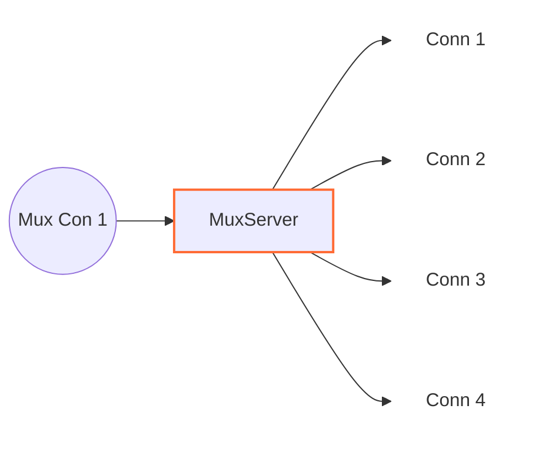

# MuxServer

## 📖 معرفی کلی

| ویژگی              | مقدار                         | توضیح                                                     |
|--------------------|-------------------------------|-----------------------------------------------------------|
| **نوع نود**        | Tunnel (یک‌طرفه)              | جریان کانکشن‌ها از چپ آغاز می‌شود و به راست پیش می‌رود   |
| **لایه شبکه**      | لایه ۴ (Transport Layer)      | کار با کانکشن‌ها است، نه بسته‌های خام                    |
| **جهت پشتیبانی**  | چپ به راست (Left to Right)    | دو‌جهته نیست؛ صرفاً یک‌طرفه                               |
| **موقعیت در زنجیره**| میانه زنجیره                 | فقط در میانه زنجیره قابل استفاده است                    |
| **وابستگی**        | حداقل یک نود قبلی و یک نود بعدی | برای دریافت و ارسال داده‌ها ضروری است                   |

---




## عملکرد

این نود مکمل نود MuxClient است و برای کارکرد صحیح Muxing الزامی است. نقش آن، خارج‌کردن جریان ورودی از حالت چندکاناله (Demultiplex) و تبدیل آن به چند کانکشن مستقل برای ارسال به نود بعدی است.

اگر در سمت کلاینت تونل برقرار کرده‌اید، این نود باید در پیکربندی سرور مقصد (خارج) قرار بگیرد.

در سناریوهای سرورِ VPN نیز این نود روی سرور VPN قرار می‌گیرد؛ جایی که کانکشن‌ها از حالت Mux خارج شده، به جریان‌های اصلی خود تبدیل می‌شوند و سپس به نود بعدی در زنجیره تحویل داده می‌شوند.

---

## ⚙️ راهنمای پیکربندی

```json
{
    "name": "node_name",
    "type": "MuxServer",
    "settings": {
    },
    "next": "next_node_name"
}
```

این نود تنظیماتی ندارد؛ تمام پارامترهای مربوط به Muxing در نود MuxClient تعریف می‌شوند.