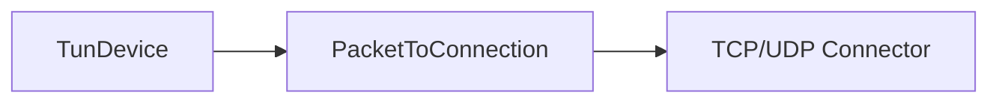
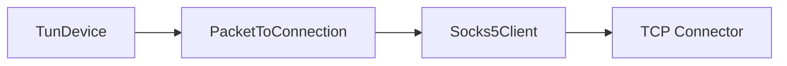

# PacketToConnection

## 📖 معرفی کلی

| ویژگی               | مقدار                          | توضیح                                                          |
|---------------------|--------------------------------|-----------------------------------------------------------------|
| نوع نود             | Tunnel (تک‌جهته)               | کانکشن‌ها از چپ آغاز شده و به راست پیش می‌روند                 |
| لایه شبکه           | لایه ۳ به ۴                    | خواندن بسته‌ها از سمت چپ و تبدیل آن‌ها به کانکشن در سمت راست    |
| موقعیت در زنجیره    | وسط زنجیر                      | فقط در میانه زنجیره قابل استفاده است                           |
| وابستگی             | نود قبل/بعد                    | برای دریافت/ارسال داده ضروری است                               |

---

## عملکرد

:::caution
این نود هنوز در دست توسعه است و استفاده از آن تخصصی است؛ برای پیاده‌سازی حالت Tun Mode به‌کار می‌رود.
:::

به‌طور خلاصه، نود TunDevice از سمت چپ بسته‌ها را ارائه می‌کند و این نود با خواندن بسته‌ها، آن‌ها را به کانکشن تبدیل کرده و در سمت راست ایجاد می‌کند.



یا برای ساخت چیزی مشابه Tun2Socks:



## ⚙️ راهنمای پیکربندی

این نود به این شکل تنظیم می‌شود:

```json
{
  "name": "node_name",
  "type": "PacketToConnection",
  "settings": {},
  "next": "next_node_name"
}
```

فعلاً تمام تنظیمات از داخل کد کنترل می‌شود و برای JSON تنظیماتی اکسپوز نشده است.

