# RawDevice

## 📖 معرفی کلی

| ویژگی               | مقدار                     | توضیح                                                                 |
|---------------------|---------------------------|------------------------------------------------------------------------|
| نوع نود             | Adapter (دو‌جهته)         | ترافیک از هر دو سمت می‌تواند ارسال و دریافت شود؛ بسته به جایگاه آن در زنجیره |
| لایه شبکه           | لایه ۳                    | کار با بسته‌ها (Packet) بدون تغییر اندازه آن‌ها                      |
| موقعیت در زنجیره    | ابتدای زنجیره یا انتهای زنجیره | فقط در ابتدای یا انتهای زنجیره قابل استفاده است                      |
| وابستگی             | نود قبل/بعد               | برای دریافت/ارسال داده ضروری است                                      |

---


این نود توانایی استخراج (capture) یا تزریق (inject) بسته‌ها به/از سیستم‌عامل را دارد.

شما در تنظیمات این نود تعیین می‌کنید بسته‌های مرتبط با کدام آی‌پی را می‌خواهید استخراج کنید؛ از آن لحظه به بعد، تمام بسته‌هایی که آی‌پی مبدأ یا مقصدشان (طبق فیلتر انتخابی) برابر با آی‌پی‌ای باشد که مشخص کرده‌اید، از سیستم‌عامل استخراج شده و خود سیستم‌عامل متوجه این موضوع نمی‌شود؛ یعنی سیستم‌عامل این ترافیک را عادی تلقی می‌کند و در لایه TCP بسته Reset ارسال نمی‌کند.

برای تزریق بسته‌ها محدودیتی وجود ندارد؛ بسته را با هر آی‌پی مبدأ یا مقصدی که وارد کنید تزریق می‌کند و سیستم‌عامل نیز از این موضوع بی‌خبر است.

:::caution
این نود فقط از IPv4 پشتیبانی می‌کند؛ تمام بسته‌هایی که نسخه IP آن‌ها غیر از ۴ باشد رد می‌شوند.
:::

:::danger
از وقتی که این نود به واتروال اضافه شد؛ برخی آنتی‌ویروس‌ها ممکن است واتروال را به‌عنوان بدافزار شناسایی کنند. از نظر ما این مورد نگران‌کننده نیست و فعلاً قصدی برای تغییر این رفتار نداریم.
:::

این نود در ویندوز به دسترسی Administrator نیاز دارد و یک Driver در کرنل قرار می‌دهد. در لینوکس از RawSocket برای نوشتن و از Netfilter برای دریافت استفاده می‌شود.

در لینوکس همچنین نیاز به iptables وجود دارد؛ واتروال هنگام خروج، قواعد افزوده‌شده به iptables را پاک‌سازی خواهد کرد.

این نود تنها روی ویندوز و لینوکس قابل استفاده است.

این نود یک آداپتر است؛ به زنجیره‌ها معنا می‌دهد. هم می‌تواند شروع‌کننده زنجیره باشد و هم پایان‌دهنده زنجیره.

:::note دقت کنید
این نود هم می‌تواند در ابتدای زنجیره قرار گیرد و هم در انتها.

### اگر در شروع زنجیره باشد
بسته‌های دریافتی به سمت راست (upstream) فرستاده می‌شوند و همچنین بسته‌هایی که از راست به چپ دریافت شوند، به سیستم‌عامل تزریق می‌شوند.

```mermaid
flowchart LR;
    OS[سیستم‌عامل] <--> R[RawDevice] -->  Ns1[Node1] -->  Ns2[Node2] --> inv[...]
    style inv fill:transparent,stroke:transparent
    style OS fill:transparent,stroke:transparent
```




### اگر در پایان زنجیره باشد
می‌توانید این نود را در پایان زنجیره نیز قرار دهید؛ در این حالت، بسته‌هایی که از چپ به راست می‌آیند به سیستم‌عامل تحویل می‌شوند و بسته‌هایی که از سیستم‌عامل دریافت می‌شوند، به سمت چپ نوشته خواهند شد.


:::

همچنین می‌توانید این نود را هم در شروع و هم در پایان قرار دهید و یک زنجیره کامل بسازید؛ فقط دقت کنید که محدوده‌های آی‌پی و نام دستگاه‌ها با هم تداخل نداشته باشند.

## ⚙️ راهنمای پیکربندی

این نود به این شکل تنظیم می‌شود:

```json
{
  "name": "node_name",
  "type": "RawDevice",
  "settings": {
    "capture-filter-mode": "source-ip",
    "capture-ip": "1.1.1.1",
    "capture-device-name": "cap0",
    "raw-device-name": "raw0"
  },
  "next": "next_node_name"
}
```

پارامتر `capture-filter-mode`


این پارامتر اختیاری است. دو حالت دارد که حالت پیش‌فرض `source-ip` است:

```json
"capture-filter-mode": "source-ip"
```
یعنی هنگام دریافت بسته‌ها، آدرس مبدأ بسته با مقدار `capture-ip` مقایسه می‌شود؛ اگر برابر بود بسته استخراج می‌شود، در غیر این صورت کاری انجام نمی‌شود.

```json
"capture-filter-mode": "dest-ip"
```
یعنی هنگام دریافت بسته‌ها، آدرس مقصد بسته با مقدار `capture-ip` مقایسه می‌شود؛ اگر برابر بود بسته استخراج می‌شود، در غیر این صورت کاری انجام نمی‌شود.

:::note نکته
عموماً از حالت `source-ip` استفاده کنید؛ اگر اطلاع کافی ندارید، بهتر است آن را تغییر ندهید یا اصلاً ست نکنید تا مقدار پیش‌فرض اعمال شود.
:::

پارامتر `capture-ip`


این پارامتر اجباری است و باید یک آی‌پی نسخه ۴ معتبر وارد کنید، مثلاً:

```json
"capture-ip": "1.1.1.1"
```
این آی‌پی برای بررسی شرط استخراج بسته‌ها به‌کار می‌رود.

:::caution
مقدار این پارامتر باید IPv4 معتبر باشد و نباید با تنظیمات دیگر شما تداخل ایجاد کند.
:::

:::caution نکته مهم
این نود درباره MTU تصمیم‌گیری نمی‌کند؛ هر بسته‌ای که از کارت شبکه دریافت کند، اگر اندازه‌اش از مقدار MTU که در `core.json` تنظیم کرده‌اید بیشتر باشد (پیش‌فرض 1500)، بسته دراپ می‌شود و این موضوع در لاگ گزارش خواهد شد.
:::

:::tip نکته
در صورت وجود مشکل مرتبط با MTU، واتروال این موضوع را به‌طور کامل در لاگ‌ها گزارش می‌کند هر بار که قرار است بسته‌ای نوشته شود؛ پس خواندن لاگ‌ها کمک‌کننده است.
:::

این دو پارامتر:

```
`capture-device-name`: ""
```

```
`raw-device-name`: ""
```

اختیاری هستند و برای استفاده داخلی کاربرد دارند؛ اگر مقدار ندهید مشکلی پیش نمی‌آید و قرار نیست به سیستم‌عامل اعلام شوند. صرفاً شاید در لاگ‌های واتروال به‌درد بخورند.


