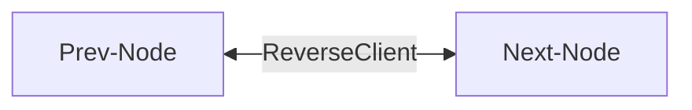
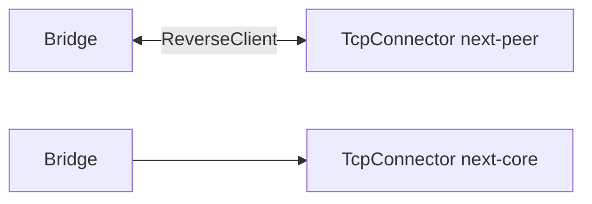

---

# ReverseClient

## 📖 معرفی کلی

| ویژگی              | مقدار                        | توضیح                                              |
|--------------------|------------------------------|----------------------------------------------------|
| **نوع نود**        | Tunnel (شروع‌کننده)          | این تونل دوجهته و شروع‌کننده است                  |
| **لایه شبکه**      | لایه ۴ (Transport Layer)     | کار با اتصال‌ها (کانکشن‌ها)، نه پکت‌های خام       |
| **موقعیت در زنجیر**| وسط زنجیر                    | فقط در وسط زنجیر قابل استفاده است                 |
| **وابستگی**        | حداقل یک نود قبلی و بعدی؛ معمولاً نود قبلی Bridge است | برای دریافت/ارسال داده ضروری است |

برای فهم طرز کار این نود، ابتدا نود Bridge را مطالعه کنید و سپس به این صفحه برگردید.

---

## عملکرد


این نود از نوع Adapter نیست، اما چون اتصال را آغاز می‌کند می‌توان تا حدی آن را به‌منزلهٔ یک Adapter نیز در نظر گرفت.

این نود قاعدهٔ «چپ‌به‌راست» را نقض می‌کند؛ اما با کمک نود Bridge این نظم برقرار می‌شود و می‌توان آن را همراه با بقیهٔ نودهای لایهٔ ۴ در زنجیره به‌صورت عادی به‌کار برد.

ابتدا یک اتصال به سمت راست ایجاد می‌کند و انتظار دارد این اتصال در نهایت به نود ReverseServer برسد. برای تشخیص/هندشیک، حدود ۶۰۰ بایت دادهٔ ثابت در این اتصال ارسال می‌شود. اگر قصد تغییر این مقدار را دارید، باید کد منبع را ویرایش کنید؛ در حالت معمول نیازی به تغییر نیست.

سپس این اتصال برای مدتی زنده نگه داشته می‌شود و اگر داده‌ای از آن دریافت شد، یک اتصال به سمت چپ (Downstream) برقرار می‌گردد. این اتصال، اتصال معمول کاربر است که معمولاً به یک سرور پروکسی یا به xray-core ختم می‌شود




## ⚙️ راهنمای پیکربندی

```json
{
    "name": "node_name",
    "type": "ReverseClient",
    "settings": {
        "minimum-unused": <number>
    },
    "next":  "next_node_name"
}
```

پارامتر `minimum-unused` اختیاری است و مشخص می‌کند چند اتصال پیشاپیش ساخته و آماده نگه داشته شوند تا توسط ReverseServer مصرف شوند.

مقدار پیش‌فرض آن ۴ به‌ازای هر worker است. اگر تعداد کاربران زیاد است، شاید بخواهید این مقدار را به‌صورت دستی افزایش دهید؛ در غیر این صورت مقدار پیش‌فرض کافی است.

نمونهٔ کامل ReverseClient برای TCP (همراه با Bridge) به شکل زیر است:




```json
{
    "name": "outbound_to_core",
    "type": "TcpConnector",
    "settings": {
        "nodelay": true,
        "address": "127.0.0.1",
        "port": 443
    }
},

{
    "name": "bridge1",
    "type": "Bridge",
    "settings": {
        "pair": "bridge2"
    },
    "next": "outbound_to_core"
},

{
    "name": "bridge2",
    "type": "Bridge",
    "settings": {
        "pair": "bridge1"
    },
    "next": "reverse_client"
},

{
    "name": "reverse_client",
    "type": "ReverseClient",
    "settings": {
        "minimum-unused": 4
    },
    "next": "outbound_to_iran"
},

{
    "name": "outbound_to_iran",
    "type": "TcpConnector",
    "settings": {
        "nodelay": true,
        "address": "1.1.1.1",
        "port": 443
    }
}
```
