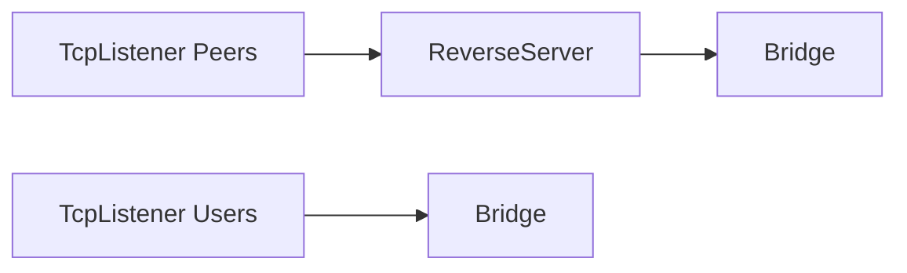

# ReverseServer

## 📖 معرفی کلی

| ویژگی              | مقدار                       | توضیح                                                                 |
|--------------------|-----------------------------|------------------------------------------------------------------------|
| **نوع نود**        | Tunnel (دوجهته)             | از هر دو سمت دریافت‌کننده و برقرارکنندهٔ اتصال است.                    |
| **لایه شبکه**      | لایهٔ ۴ (Transport Layer)   | کار با اتصال‌ها انجام می‌شود، نه با بسته‌های خام (Raw Packets).       |
| **موقعیت در زنجیره**| وسط زنجیره                  | فقط در میانهٔ زنجیره قابل استفاده است و معمولاً نود بعدی آن Bridge است.|
| **وابستگی**        | حداقل یک نود قبل و بعد      | برای دریافت و ارسال داده به نودهای مجاور نیاز دارد.                    |

برای درک بهتر طرز کار این نود، ابتدا صفحهٔ مربوط به نود Bridge را مطالعه کنید و سپس به این صفحه برگردید.

---

## عملکرد

- در مسیر چپ 🡐 راست، این نود پذیرندهٔ اتصال‌های ReverseClient است (دقت کنید که منظور اتصال‌های کاربران نهایی نیست).
- در مسیر راست 🡐 چپ (از بالا)، این نود اتصال‌های کاربران را می‌پذیرد. ظاهراً این رفتار قاعدهٔ «چپ به راست» را نقض می‌کند، اما با قرار دادن Bridge در جایگاه مناسب، مسیرها به‌درستی مدیریت می‌شوند.



## ⚙️ راهنمای پیکربندی

```json
{
  "name": "node_name",
  "type": "ReverseServer",
  "settings": {},
  "next": "next_node_name"
}
```

این نود تنظیمات اختصاصی ندارد؛ اما چیدمان آن در زنجیره اهمیت دارد. تقریباً همیشه یک Bridge بلافاصله قبل/بعد از آن قرار می‌گیرد تا مسیرها به‌درستی جفت شوند.

نمونهٔ کامل:

```json
{
  "name": "users_inbound",
  "type": "TcpListener",
  "settings": {
    "address": "0.0.0.0",
    "port": 443,
    "nodelay": true
  },
  "next": "b2"
},
{
  "name": "b2",
  "type": "Bridge",
  "settings": {
    "pair": "b1"
  }
},
{
  "name": "b1",
  "type": "Bridge",
  "settings": {
    "pair": "b2"
  }
},
{
  "name": "reverse_server",
  "type": "ReverseServer",
  "settings": {},
  "next": "b1"
},
{
  "name": "kharej_inbound",
  "type": "TcpListener",
  "settings": {
    "address": "0.0.0.0",
    "port": 443,
    "nodelay": true,
    "whitelist": ["1.1.1.1/32"]
  },
  "next": "reverse_server"
}
```

- فراموش نکنید آی‌پی صحیح سرور خارج را در بخش `whitelist` قرار دهید.
- در سناریوهای Reverse، افزودن لایه‌های امنیتی/بهینه‌سازی مانند TLS، Mux، Reality و … بر حسب نیاز توصیه می‌شود. مثال بالا ساده‌ترین حالت TCP است.