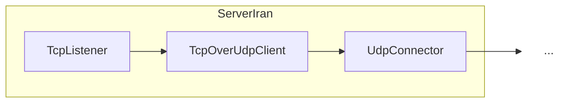
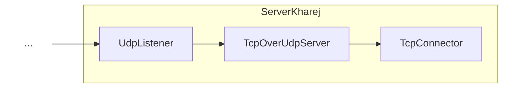

# TcpOverUdpClient

## 📖 معرفی کلی

| ویژگی              | مقدار                    | توضیح                                                     |
|--------------------|--------------------------|-----------------------------------------------------------|
| **نوع نود**        | تونل (تک‌جهته)          | جریان داده از چپ آغاز می‌شود و به راست پیش می‌رود         |
| **لایه شبکه**      | لایه ۴ (Transport)       | کار با اتصال‌ها (TCP/UDP)، نه بسته‌های خام               |
| **موقعیت در زنجیر**| میانه زنجیره             | فقط در میانه زنجیره قابل استفاده است                     |
| **وابستگی**        | حداقل یک نود قبل و بعد   | برای دریافت و ارسال داده‌ها ضروری است                    |

---

## عملکرد

این نود برای عبور جریان‌های TCP از روی بسترهای غیرقابل‌اعتماد مانند UDP طراحی شده است.

TCP تضمین‌هایی مانند ترتیب صحیح دریافت داده، جلوگیری از از دست رفتن بسته‌ها و تحویل کامل داده ارائه می‌دهد؛ در حالی که UDP هیچ‌کدام از این موارد را تضمین نمی‌کند.

### چرا TCP را روی UDP تونل کنیم؟
- اگر روشی برای تونل‌سازی مبتنی بر UDP داشته باشیم و بخواهیم ترافیک TCP را از آن عبور دهیم، به این نود نیاز داریم.
- بسیاری از پروتکل‌ها (مانند پروتکل‌های V2Ray) مبتنی بر TCP هستند و برای عبور از تونل UDP باید TCP را روی UDP حمل کنیم.
- در برخی سناریوها (مانند گیمینگ) UDP تأخیر و سربار کمتری دارد و می‌تواند مزیت‌هایی فراهم کند؛ هرچند همیشه بهترین انتخاب نیست.

در عین حال معمولاً در سیستم‌های فیلترینگ فشار بیشتری روی UDP وارد می‌شود، Packet Loss ایجاد می‌گردد یا حتی گاهی به‌طور کامل مسدود می‌شود؛ بنابراین استفاده از تونل UDP انتخابی تخصصی و وابسته به شرایط است.

### نحوه پیاده‌سازی

قابلیت‌های کلیدی TCP روی UDP توسط کتابخانهٔ شناخته‌شده و قدرتمند KCP شبیه‌سازی می‌شود.

توجه داشته باشید که این نود باعث افزایش مصرف ترافیک بین ۱۰ تا ۲۰ درصد بین خودش و نود جفتش (یعنی `TcpOverUdpServer`) می‌شود.

اگر از تونل استفاده می‌کنید، این افزایش ترافیک بین «سرور ایران» و «سرور خارج» رخ می‌دهد و بین «کاربر» و «سرور ایران» افزایشی نداریم. این یعنی معمولاً برای حدود نیمی از این مقدار هزینه می‌پردازید (چون ترافیک آپلود عموماً رایگان است).

این نود تنظیمات خاصی نیاز ندارد. دیاگرام استفاده در سناریوی تونل به‌شکل زیر است:





---

نمونه پیکربندی:

```json
{
    "name": "node_name",
    "type": "TcpOverUdpClient",
    "settings": {},
    "next": "next_node_name"
}
```

توجه: این نود حتماً به جفت خود نیاز دارد و باید در ادامهٔ زنجیره، نود `TcpOverUdpServer` حضور داشته باشد.

---

## نکات پیشرفته

- تونل‌زدن با UDP و استفاده از این نود برای کانفیگ‌های گیمینگ مناسب است و مزیت‌هایی دارد، اما در عین حال پهنای‌باند مؤثر کمتری ارائه می‌دهد.
- اگر بین «سرور ایران» و «سرور خارج» (بین مبدأ و مقصد) Packet Loss شدید باشد (بالاتر از ۱۰٪)، کیفیت این روش به‌طور محسوسی افت می‌کند.
- در برخی تجربه‌ها روی IPهای Hetzner، Packet Loss بالای ۳۰٪ مشاهده شده است؛ شرایط شبکه می‌تواند متغیر باشد.

- دوستانی که اطلاعات شبکه قوی ای داشته باشند میدونن که TcpOverUdp با استفاده از نود های TunDevice,RawDevice,IpManipulator هم می شد انجام داد ولی 
معایب خودشو داشت ؛ فشار بیشتر به سیستم عامل میاورد و دسترسی روت نیاز داشت و انتقال دیتا بین کرنل و بعد پروسس دوباره پکت ها شاید 
حدود ۱ میلی ثانیه پینگ را زیاد تر می کرد و همچنین قابلیت زنجیر کردن و ساختن سناریو ها رو سخت تر میکرد چون ۲ تا زنجیر نیاز بود و یکیش فقط لایه ۳ می شد.

### برنامه‌های آینده

- در آینده الگوریتم Reed–Solomon (احتمالاً در همین نود یا به‌صورت نود جدید) اضافه خواهد شد. با استفاده از این الگوریتم می‌توان Packet Loss را تا حد خوبی با هزینهٔ مصرف پهنای‌باند بیشتر و سربار محاسباتی کاهش داد. این یک روش تصحیح خطای پیشرو (FEC) است که با افزونگی کنترل‌شده، کیفیت عبور داده را در شرایط نامطلوب شبکه بهبود می‌دهد.

و همچنین هزینه سربار این الگوریتم رو احتمالا زیاد نیاز نبود پرداخت کنید چون پکت هایی که لاس میشن براش کسی پول پرداخت نمی کنه.


