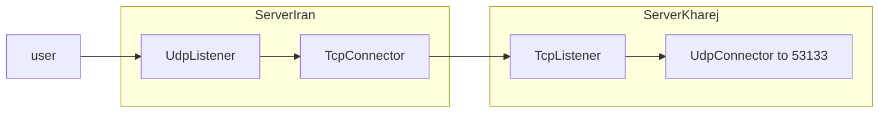
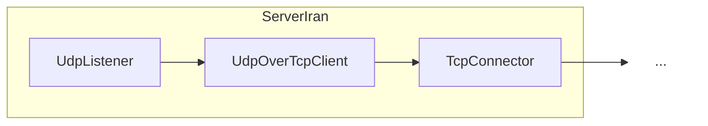
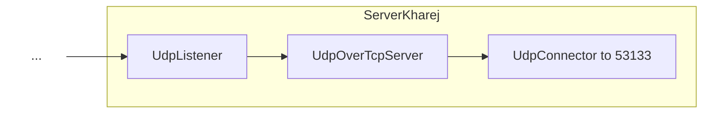

# UdpOverTcpClient

## 📖 معرفی کلی

| ویژگی              | مقدار                    | توضیح                                                     |
|--------------------|--------------------------|-----------------------------------------------------------|
| **نوع نود**        | تونل (تک‌جهته)          | جریان داده از چپ آغاز می‌شود و به راست پیش می‌رود         |
| **لایه شبکه**      | لایه ۴ (Transport)       | کار با اتصال‌ها (TCP/UDP)، نه بسته‌های خام               |
| **موقعیت در زنجیر**| میانه زنجیره             | فقط در میانه زنجیره قابل استفاده است                     |
| **وابستگی**        | حداقل یک نود قبل و بعد   | برای دریافت و ارسال داده‌ها ضروری است                    |

---

## عملکرد

این نود برای عبور دادن ترافیک UDP از روی اتصال‌های TCP طراحی شده است. یکی از رایج‌ترین سناریوهای استفاده:

برای توضیح عملکرد، یک مثال ساده می‌زنیم: می‌خواهیم یک تونل بسازیم.

فرض کنید کاربر، کانفیگ WireGuard را طوری تنظیم کرده که به پورت 443 سرور ایران متصل شود و قصد داریم آن را به سرور خارج روی پورت 53133 متصل کنیم. در این سناریو با ترافیک UDP سروکار داریم.



این سناریو در وضعیت فعلی کار نخواهد کرد؛ به دلیل تفاوت ماهیت UDP و TCP.

وقتی داده‌های UDP بخواهند از روی یک سوکت مبتنی بر استریم مثل TCP عبور کنند، لازم است مرز بسته‌ها حفظ شود. UDP پیام‌محور و حساس به اندازه بسته است، اما TCP جریان‌محور است و مرز بسته ندارد.

برای اینکه سناریوی بالا درست کار کند، باید این دو نود را اضافه کنیم:





نکته: در سمت مقابل باید نود `UdpOverTcpServer` قرار گیرد تا بتوان مرز بسته‌های UDP را بازسازی کرد.

---

این نود تنظیمات خاصی ندارد.

```json
{
    "name": "node_name",
    "type": "UdpOverTcpClient",
    "settings": {},
    "next": "next_node_name"
}
```

این نود به هر بسته‌ای که از چپ به راست عبور می‌کند، ۲ بایت در ابتدای آن اضافه می‌کند تا طول بسته نگه‌داری شود.

فراموش نکنید که این نود باید با جفتش استفاده بشه ؛ در سرور خارج از UdpOverTcpServer استفاده کنید تا دیتا به حالت عادی برگرده
