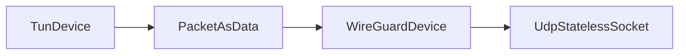

# UdpStatelessSocket

## 📖 معرفی کلی

| ویژگی              | مقدار                        | توضیح                                              |
|--------------------|------------------------------|----------------------------------------------------|
| نوع نود            | Adapter (دوجهته)             | سوکت UDP دوجهته                                   |
| لایه شبکه          | لایه ۳ و ۴                    | کار با بسته‌های UDP به‌صورت stateless (بدون اتصال) |
| موقعیت در زنجیره    | ابتدا یا انتهای زنجیره        | فقط در ابتدا یا انتهای زنجیره قابل استفاده است    |
| وابستگی            | نود قبل/بعد                  | برای دریافت/ارسال داده ضروری است                  |

## عملکرد

این نود در اصل برای WireGuard طراحی شده، اما می‌تواند در سناریوهای دیگر هم به‌کار گرفته شود.

از نظر رفتاری شبیه `UdpListener` / `UdpConnector` است، با این تفاوت که:
- دوجهته است
- با نودهای لایه ۳ نیز سازگار است

روی یک IP و پورت مشخص گوش می‌دهد و از همان سوکت برای ارسال بسته‌های UDP به بیرون نیز استفاده می‌کند. بنابراین می‌تواند در ابتدای زنجیره یا در انتهای زنجیره قرار بگیرد.

## ⚙️ راهنمای پیکربندی

```json
{
  "name": "node_name",
  "type": "UdpStatelessSocket",
  "settings": {
    "listen-address": "0.0.0.0",
    "listen-port": 1234
  },
  "next": "next_node_name"
}
```

### listen-address

آدرس IP که سوکت روی آن ساخته و گوش می‌کند.

### listen-port

پورتی که سوکت روی آن گوش می‌کند و از همان برای ارسال نیز استفاده می‌شود.

---

این نود بسته‌ها را به مقصدی که در `dest-ctx` تعریف شده ارسال می‌کند؛ معمولاً این مقدار توسط نود WireGuard تنظیم می‌شود.

همچنین مانند نودهای «لایهٔ بسته»، نیازی به مفهوم Connection ندارد؛ می‌توان از ابتدا بدون برقرار بودن اتصال قبلی، به آن بسته داد. به‌صورت مستقل نیز قادر به دریافت بسته است.

---

## مثال عملی: WireGuard 🚀

اگر با WireGuard آشنا باشید، ساختاری شبیه OpenVPN دارد اما چند نقطه قوت باعث می‌شود در شرایط ایده‌آل (بدون فیلترینگ) یکی از بهترین‌ها باشد:

### 🔥 مزایای WireGuard
1. 📡 UDP: از UDP برای انتقال داده استفاده می‌کند؛ بسته‌ها یکپارچه منتقل می‌شوند (البته با MTU کمتر).
2. 🔐 رمزنگاری مدرن: بر پایهٔ الگوریتم‌های مینیمال و مدرن مانند `Curve25519` و `ChaCha20-Poly1305` است:
   - سبک و CPU-friendly
   - نیازمند هندشیک کمتر
   - امن

### 📊 ساختار WireGuard با واتروال

#### سمت کلاینت



#### سمت سرور VPN


### 🔍 چرا UdpStatelessSocket؟

علت استفاده نکردن از `UdpListener` / `UdpConnector` این است که در WireGuard از همان سوکت و پورت که با آن ارسال انجام می‌شود، دریافت هم صورت می‌گیرد.

- `UdpListener` فقط گوش‌دهنده است و نمی‌تواند آغازگر ارسال به یک همتا (peer) باشد.
- `UdpConnector` فقط ارسال‌کننده است و وقتی همتا قبل از آن بسته‌ای فرستاده، توان پردازش دریافت را ندارد.

✅ بنابراین نود جدیدی طراحی شد که از یک پورت هم ارسال کند و هم گوش دهد: `UdpStatelessSocket`.

