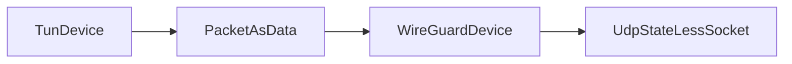
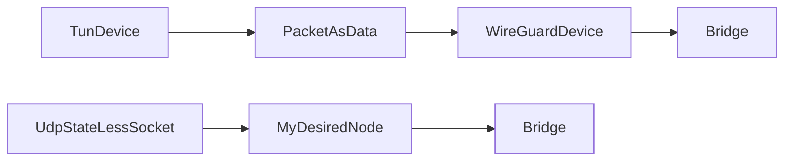
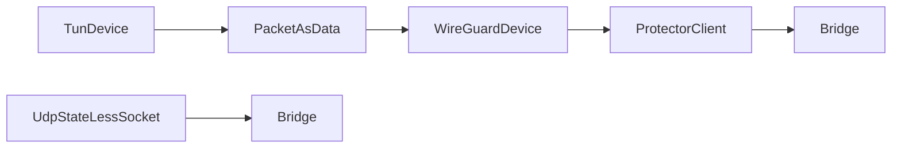
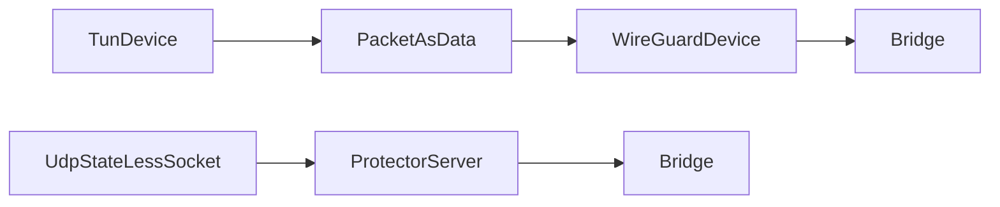

# WireGuardDevice

## 📖 معرفی کلی

| ویژگی              | مقدار                        | توضیح                                              |
|--------------------|------------------------------|----------------------------------------------------|
| نوع نود            | tunnel (تک جهته)             | از سمت چپ با tun device کار می کند و اس                                 |
| لایه شبکه          | لایه ۳ و ۴                    | کار با بسته‌های UDP به‌صورت stateless (بدون اتصال) |
| موقعیت در زنجیره    | ابتدا یا انتهای زنجیره        | فقط در ابتدا یا انتهای زنجیره قابل استفاده است    |
| وابستگی            | نود قبل/بعد                  | برای دریافت/ارسال داده ضروری است                  |


## عملکرد

این نود پیاده‌سازی کاملی از پروتکل WireGuard است که به صورت دوطرفه کار می‌کند.

### جهت ارسال (چپ به راست)
- از سمت چپ، پکت‌های لایه ۳ را از TUN device دریافت می‌کند
- این پکت‌ها را رمزنگاری کرده و در قالب UDP به سمت راست ارسال می‌کند
- معمولاً از نود `UdpStatelessSocket` برای ارسال استفاده می‌شود

### جهت دریافت (راست به چپ)  
- پکت‌های UDP رمزنگاری شده را از peer خود دریافت می‌کند
- آن‌ها را رمزگشایی کرده و به صورت پکت‌های لایه ۳ به سمت چپ ارسال می‌کند

### ساختار عمومی
WireGuard ساختار مشخصی دارد که مستقل از کلاینت یا سرور بودن است:




یعنی حتی اگر تونل راه‌اندازی کنید، فایل‌های JSON در سرور ایران و خارج یکسان خواهند بود.

## استفاده از Bridge برای پردازش اضافی

اگر نود لایه ۳ تک‌جهته‌ای (چپ به راست) دارید و می‌خواهید قبل از ارسال یا دریافت داده‌های UDP، پردازش اضافی روی پکت انجام دهید، می‌توانید از نود `Bridge` استفاده کنید:




در این مثال، `UdpStatelessSocket` پکت‌های دریافتی را به سمت راست می‌فرستد تا `MyDesiredNode` عملیات مورد نظر را روی داده‌های دریافت شده انجام دهد.

## مثال کامل: WireGuard با رمزنگاری اضافی

فرض کنیم می‌خواهیم بین سرور ایران و خارج، کانکشن WireGuard برقرار کنیم و علاوه بر رمزنگاری داخلی WireGuard، یک لایه رمزنگاری اضافی نیز داشته باشیم.

برای این کار، دو نود فرضی زیر را در نظر می‌گیریم:

- `ProtectorClient` → رمزنگاری داده‌ها
- `ProtectorServer` → رمزگشایی داده‌ها

این نودها نیز چپ به راست کار می‌کنند.

### پیکربندی سرور ایران:



### پیکربندی سرور خارج:



با این مثال، مفهوم استفاده از `Bridge` با WireGuard روشن شده است. حتماً صفحه مستندات `Bridge` را نیز مطالعه کنید.

## ⚙️ راهنمای پیکربندی

### ساختار JSON

```json
{
  "name": "node_name",
  "type": "WireGuardDevice",
  "settings": {
    "privatekey": "your_private_key_here",
    "peers": {
      "peer1": {
        "publickey": "peer_public_key_here",
        "presharedkey": "optional_preshared_key",
        "endpoint": "1.2.3.4:51820",
        "allowedips": "10.0.0.2/32, fd86:ea04:1115::2/128",
        "persistentkeepalive": 25
      }
    }
  },
  "next": "next_node_name"
}
```

### شرح پارامترهای تنظیمات

#### پارامترهای اصلی

| پارامتر | نوع | الزامی | توضیح |
|---------|-----|--------|-------|
| `name` | string | ✅ | نام یکتای نود در پیکربندی |
| `type` | string | ✅ | نوع نود که باید `WireGuardDevice` باشد |
| `next` | string | ✅ | نام نود بعدی در زنجیره |

#### تنظیمات WireGuard (`settings`)

| پارامتر | نوع | الزامی | توضیح |
|---------|-----|--------|-------|
| `privatekey` | string | ✅ | کلید خصوصی این دستگاه WireGuard (base64) |
| `peers` | object | ✅ | لیست همتایان (peers) که با آن‌ها ارتباط برقرار می‌شود |

#### تنظیمات هر Peer

| پارامتر | نوع | الزامی | توضیح |
|---------|-----|--------|-------|
| `publickey` | string | ✅ | کلید عمومی peer مقصد (base64) |
| `endpoint` | string | ❌ | آدرس IP و پورت peer (`IP:PORT`) |
| `allowedips` | string | ✅ | محدوده IP هایی که از طریق این peer رد می‌شوند |
| `presharedkey` | string | ❌ | کلید مشترک اضافی برای امنیت بیشتر (base64) |
| `persistentkeepalive` | number | ❌ | فاصله زمانی ارسال پکت keep-alive (ثانیه) |

### توضیحات تکمیلی

#### `privatekey`
- **نوع**: رشته base64
- **الزامی**: بله
- **توضیح**: کلید خصوصی 32 بایتی که منحصر به این دستگاه است
- **مثال**: می‌توانید با دستور `wg genkey` تولید کنید

#### `publickey`
- **نوع**: رشته base64  
- **الزامی**: بله (برای هر peer)
- **توضیح**: کلید عمومی peer که با کلید خصوصی آن متناظر است
- **مثال**: از کلید خصوصی peer با `wg pubkey` قابل تولید

#### `endpoint`
- **نوع**: رشته
- **الزامی**: خیر
- **توضیح**: آدرس و پورت peer برای برقراری اتصال اولیه
- **نکته**: اگر تعریف نشود، فقط اتصالات ورودی پذیرفته می‌شود
- **فرمت**: `IP:PORT` یا `domain.com:PORT`

:::caution
اگه endpoint قرار ندهید ؛ این نود هندشیک را شروع نمیکنه ولی peer میتونه به ما هندشیک کنه و کانکشن را برقرار کنه.
:::

#### `allowedips`
- **نوع**: رشته
- **الزامی**: بله
- **توضیح**: محدوده‌های IP که از طریق این peer مسیریابی می‌شوند
- **فرمت**: می‌تواند چندین محدوده با کاما جدا شده باشد
- **مثال**: `0.0.0.0/0` برای تمام ترافیک IPv4

#### `presharedkey`
- **نوع**: رشته base64
- **الزامی**: خیر
- **توضیح**: کلید 32 بایتی اضافی برای امنیت post-quantum
- **نکته**: هر دو طرف باید همین کلید را داشته باشند

#### `persistentkeepalive`
- **نوع**: عدد صحیح
- **الزامی**: خیر
- **توضیح**: فاصله زمانی ارسال پکت‌های نگه‌دارنده اتصال (ثانیه)
- **کاربرد**: برای حفظ اتصال در برابر NAT و فایروال
- **پیشنهاد**: 25 ثانیه برای اتصالات پایدار

### نکات مهم
- همه کلیدها باید در فرمت base64 باشند
- `allowedips` تعیین می‌کند چه ترافیکی از طریق هر peer عبور کند
- `endpoint` فقط برای اتصال اولیه استفاده می‌شود
- حداقل یک peer باید تعریف شود